# Introduction

This article is going to be focused on taking a tour through some of the mechanisms of epoll. Let’s start by just giving a brief quote to introduce what epoll is to frame the conversation.

> epoll is a Linux kernel system call for a scalable I/O event notification mechanism (…) Its function is to monitor multiple file descriptors to see whether I/O is possible on any of them.

Which gives us some sense of what we are talking about. But I find that a better way to introduce epoll is to introduce the problem that it solves. 

> The classic Unix way to wait for I/O events on multiple file descriptors is with the select() and poll() system calls. When a process invokes one of those calls, the kernel goes through the list of interesting file descriptors, checks to see if non-blocking I/O is available on any of them, and adds the calling process to a wait queue for each file descriptor that would block. This implementation works reasonably well when the number of file descriptors is small. But if a process is managing thousands of file descriptors, the select() and poll() calls must check every single one of them, and add the calling process to thousands of wait queues. For every single call. Needless to say, this approach does not scale very well. [14](https://lwn.net/Articles/13587/)

This quote comes from the initial introduction of epoll into the Linux kernel in late 2002. The idea, being rather explicitly outlined, was that watching changes on file descriptors was far too slow at as the count numbered in the thousands. We will discuss why that is done important shortly, but monitoring thousands of file descriptors is one of the foundations of computing today. It’s not uncommon for a single service to get into the tens of thousands of file descriptors. [21](https://www.kegel.com/c10k.html) Runtimes that ended up depending on this change, like Node.js, wouldn’t be released until 7 years later, and the foundational event loop for Node.js called [libuv](/blog/libuv) would not be released 2011. It’s not a stretch today to say that epoll is one of the foundations of the internet. [17](https://darkcoding.net/software/epoll-the-api-that-powers-the-modern-internet/) In order to understand epoll, the problems it solves and the problems it creates, you have to understand two major ideas: file descriptors and triggering. Let’s start by talking about file descriptors. As with any library, the content in this article may drift towards incorrect over time. This article has been drafted with a lens for Linux `v6.8`. This article will provide an incomplete picture, and if the reader finds themselves wanting for more details, I would encourage [diving into the the Linux source coude](https://github.com/torvalds/linux).

# File descriptors

There will be two very similar terms that we will be introducing, **file descriptors** and **file descriptions**. It’s very important to note that while these two ideas are related, they represent different concepts. A file descrition is fundamentally an internal data structure in the linux kernel, we will revisit them momentarily. The important part is **file descriptions are an internal data structure, not to be confused with the more common file descriptors**. We will see why this statement is important later. So what are **file descriptors**?

> In Unix and related computer operating systems, a file descriptor (FD, less frequently fildes) is an abstract indicator (handle) used to access a file or other input/output resource, such as a pipe or network socket. [4](https://en.wikipedia.org/wiki/File_descriptor)

That is to say, if you are doing I/O, you are using a file descriptor. File descriptors are process bounded, that is to say that the table that manages file descriptors is mostly unique to a process. This table can be seen below.

```c
struct fdtable {
  unsigned int        max_fds;
  struct file __rcu **fd;      /* current fd array */
  unsigned long      *close_on_exec;
  unsigned long      *open_fds;
  unsigned long      *full_fds_bits;
  struct              rcu_head rcu;
};
```

We can see some information about the maximum number of file descriptors. We have an array of structures called `file`, then some extended information about some properties within the file descriptor table. So, how would this get populated with information? Let's start by breaking down the simplest example we can create.

```c
#include <unistd.h>
#include <fcntl.h>
#include <stdio.h>

int main(int f, char *argv[]) {
  int fd = open("abc.txt", O_RDWR | O_CREAT | O_TRUNC, 0666);
  write(fd, "foo", 3);
  close(fd);
  return 0;
}
```

In this example, we start by opening a file `"abc.txt"`. This file is opened with the permissions `666`, which indicates that the owner, the group and other can all read and write. [15](https://en.wikipedia.org/wiki/File-system_permissions) It passes in three flags, represent three ideas: the file is opened in a read/write mode (`O_RDWR`); if the file does not exist, create it as a regular file (`O_CREAT`); if the file already exists and is a regular file, and the access mode allows writing, it will be truncated to length 0 (`O_TRUNC`). We then proceed to immediately write the data `"foo"` to the integer returned from the `open()` call. This integer represents a file descriptor, more specifically a small, nonnegative integer that is an index to an entry in the process's table of open file descriptors. [16](https://man7.org/linux/man-pages/man2/open.2.html) We finally wrap up by closing the open file descriptor, and our text file now contains the text `foo`. The question remains though, how do we get from an integer to writing data on a filesystem?

We can start to answer that question with a simplistic view of the world, much like our previous test program. We can break down I/O interactions on Linux into three main components: file descriptors, file tables, and inode tables. Those relationships can be seen here. As a note, we are going to be focused on **file handling** in Linux, a great deal of the concepts apply in pipes and sockets, however, it's just easier to view the world as files.

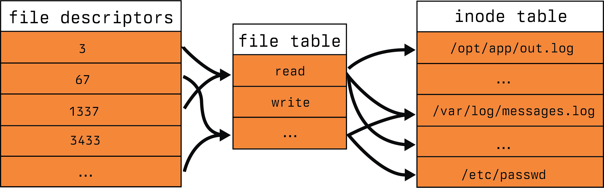

## File table

File tables are the bridge between the application view of the world and the filesystems view of the world. File tables bridge file descriptors and inodes with information about the mode of access.

> In the traditional implementation of Unix, file descriptors index into a per-process file descriptor table maintained by the kernel, that in turn indexes into a system-wide table of files opened by all processes, called the file table. This table records the mode with which the file (or other resource) has been opened: for reading, writing, appending, and possibly other modes. [4](https://en.wikipedia.org/wiki/File_descriptor)

Unfortunately, this model only exists in theory. In reality, there is no large table that represents the bridge between files. Instead we have a following structure.

```c
struct file {
  union {
    struct llist_node f_llist;
    struct rcu_head   f_rcuhead;
    unsigned int      f_iocb_flags;
  };

  /*
   * Protects f_ep, f_flags.
   * Must not be taken from IRQ context.
   */
  spinlock_t           f_lock;
  fmode_t              f_mode;
  atomic_long_t        f_count;
  struct mutex         f_pos_lock;
  loff_t               f_pos;
  unsigned int         f_flags;
  struct fown_struct   f_owner;
  const struct cred   *f_cred;
  struct file_ra_state f_ra;
  struct path          f_path;
  struct inode        *f_inode;  /* cached value */
  const struct file_operations  *f_op;

  /* ... skipped */

#ifdef CONFIG_EPOLL
  /* Used by fs/eventpoll.c to link all the hooks to this file */
  struct hlist_head  *f_ep;
#endif /* #ifdef CONFIG_EPOLL */
  struct address_space  *f_mapping;
  errseq_t    f_wb_err;
  errseq_t    f_sb_err; /* for syncfs */
}
```

As you can see from the above, there is some information about the flags for the file, the read ahead state of the file, the position, locks, etc. Rather curiously, there are epoll mechanisms contained within the struct as well. That is to say, there is a fair amount going on with this data structure. This is what is often referred to as a **file description**. This data structure was referenced previous in our process file descriptor table previously. The most important piece I want to call out is the `struct inode` reference in the file. This is the means by which file descriptors are able to reference filesystem elements known as `inodes`. So what is an inode?

## inode table

An inode is a representation of a file system object. This one of the four major components of any given filesystem in Linux. Those four being:

1. superblock
2. inode
3. file
4. dentry

The formal definition highlights some additional pieces.

> An inode (index node) is a data structure in a Unix-style file system that describes a file-system object such as a file or a directory. Each inode stores the attributes and disk block locations of the object's data. File-system object attributes may include metadata (times of last change, access, modification), as well as owner and permission data. [5](https://en.wikipedia.org/wiki/Inode)

However, much like the file table, the inode table doesn't exist. It's an abstraction, in reality, it's just references. Each filesystem contains it's own version of the inode table, called a superblock. We won't discuss the intricacies of particular file system superblock management here, we will instead stop at the discussing of the `struct inode`. 

```c
struct inode {
  umode_t         i_mode;
  unsigned short  i_opflags;
  kuid_t          i_uid;
  kgid_t          i_gid;
  unsigned int    i_flags;

  /* ...skipped */

  const struct inode_operations  *i_op;
  struct super_block             *i_sb;
  struct address_space           *i_mapping;

  /* ...skipped */

  /* Stat data, not accessed from path walking */
  unsigned long    i_ino;
  /*
   * Filesystems may only read i_nlink directly.  They shall use the
   * following functions for modification:
   *
   *    (set|clear|inc|drop)_nlink
   *    inode_(inc|dec)_link_count
   */
  union {
    const unsigned int i_nlink;
    unsigned int       __i_nlink;
  };
  dev_t              i_rdev;
  loff_t             i_size;
  struct timespec64  __i_atime;
  struct timespec64  __i_mtime;
  struct timespec64  __i_ctime; /* use inode_*_ctime accessors! */
  spinlock_t         i_lock;  /* i_blocks, i_bytes, maybe i_size */
  unsigned short     i_bytes;
  u8                 i_blkbits;
  u8                 i_write_hint;
  blkcnt_t           i_blocks;

  /* ...skipped */

  /* Misc */
  unsigned long        i_state;
  struct rw_semaphore  i_rwsem;

  unsigned long    dirtied_when;  /* jiffies of first dirtying */
  unsigned long    dirtied_time_when;

  struct hlist_node  i_hash;
  struct list_head   i_io_list;  /* backing dev IO list */

  /* ...skipped */

  struct list_head  i_lru;    /* inode LRU list */
  struct list_head  i_sb_list;
  struct list_head  i_wb_list;  /* backing dev writeback list */
  union {
    struct hlist_head  i_dentry;
    struct rcu_head    i_rcu;
  };
  atomic64_t    i_version;
  atomic64_t    i_sequence; /* see futex */
  atomic_t      i_count;
  atomic_t      i_dio_count;
  atomic_t      i_writecount;

  /* ...skipped */

  union {
    const struct file_operations  *i_fop;  /* former ->i_op->default_file_ops */
    void (*free_inode)(struct inode *);
  };
  struct file_lock_context  *i_flctx;
  struct address_space       i_data;
  struct list_head           i_devices;
  union {
    struct pipe_inode_info  *i_pipe;
    struct cdev             *i_cdev;
    char                    *i_link;
    unsigned                 i_dir_seq;
  };

  __u32      i_generation;

  /* ...skipped */

  void      *i_private; /* fs or device private pointer */
}
```

Even with the skipped lines of code, there is a fair number of pieces in play within this struct. We have `dentry` references, pipe information, block and bytes information, modification, creation and access times along with semaphores. This would be too much to discuss in one blog article and perhaps one day, I will focus on the interactions of file systems with `struct inode`. For now, when we look at this in practice we are going to break down the concept into smaller pieces that are easier to process.

## File descriptors in practice

There is so much to file descriptors (often referred to as **fide** from here in), file descriptions and inodes, so we are going to simplify them. We are going to break down into the following five reductive statements.

1. We will assume there is a system wide table called the `open file table`, like the file table previously described.
2. We will assume there is a system wide table called the `inode table`, like the inode table previously described.
3. Inodes are comprised of:
   1. type
   2. permissions
4. File descriptions, or file table entries, are comprised of:
   1. file offset
   2. status flags
   3. inode pointers
5. File descriptors are comprised of:
   1. file descriptor id, `fd`
   2. flags
   3. file description pointers, `flag ptr`

These aren't completely outlandish, and give us a reasonable frame of reference to discuss the more important pieces of polling. With that, our view of the world resemebles the following.


We have up to this point, looked at the intricacies of the pieces that make up this diagram, and a simple example that writes to a file, but what would a real interaction look like? The following is an example of a simple HTTP server that helps to better illustrate a real world use case.

```c
void server_serve(server_t **server) {
  struct sockaddr_storage their_addr;
  socklen_t socket_in_size;
  long connection_count = 0;
  int incoming;

  server_bind(server);
  server_listen(server);

  while(1) {
    socket_in_size = sizeof(their_addr);
    incoming = accept((*server)->fdsocket, (struct sockaddr *)&their_addr, &socket_in_size);
    if (incoming == -1) {
      fprintf(stderr, "%s @ %d: failed to accept incoming connection, error: %s\n", __FILE__, __LINE__, strerror(errno));
      continue;
    }

    context_t* incomingctx;
    incomingctx = malloc(sizeof(context_t));

    incomingctx->id = connection_count;
    incomingctx->fdincoming = incoming;
    incomingctx->server = server;
    incomingctx->hstart = time(NULL);

    connection_count++;

    server_parseheader(&incomingctx);
    if (incomingctx->error != None) {
      switch (incomingctx->error) {
        case ClientClosedError:
          server_sendheader(&incomingctx, ERROR, 0);
          break;
        case RecvError:
          server_sendheader(&incomingctx, ERROR, 0);
          break;
        case HeaderParseError:
          server_sendheader(&incomingctx, INVALID, 0);
          break;
        default:
          server_sendheader(&incomingctx, ERROR, 0);
          break;
      }
      server_abort(&incomingctx);
    } else {
      long fstart = time(NULL);
      incomingctx->fstart = fstart;
      if((*server)->handler(&incomingctx, incomingctx->path, (*server)->arg) < 0) {
        fprintf(stderr, "%s @ %d: request failed, error: %s\n", __FILE__, __LINE__, strerror(errno));
        continue;
      }

      client_wait(incoming, fstart, connection_count);
      close(incoming);
      if (incomingctx != NULL) {
        free(incomingctx);
      }
    }
  }
}
```

In the above, we use file descriptors at the start of the while loop as part of the `accept()` [18](https://www.man7.org/linux/man-pages/man2/accept.2.html) call. We previously have established a file descriptor for the socket handling in the `server_bind` which has been truncated for brevity sake. From there, we accept an incoming connection on that file descriptor for the socket, given by `(*server)->fdsocket`. That incoming file descriptor is then used in the `incomingctx` and passed as the `fdincoming`. From there, we are able to pass that off to our server handler who has enough information on the `incomingctx` reference to proceed. For all intents and purposes, this is basically how every HTTP server in the world works, you bind to a socket, accept incoming connections, pass off the connection to a handler who has the responsibility and passing the requisite information.

Now for understanding **epoll**, there are two additional concepts we need to discuss. Those being `fork()` [19](https://www.man7.org/linux/man-pages/man2/fork.2.html) and one of the flags for file descriptors called `O_CLOEXEC`, which stands for Open Close-on-Exec. Let's take about `fork()` first. Coming back to our very simple example, we had a simple program that wrote `"foo"` to a file `abc.txt`. But what happens now?

```c
#include <unistd.h>
#include <fcntl.h>
#include <stdio.h>

int main(int f, char *argv[]) {
  int fd = open("abc.txt", O_RDWR | O_CREAT | O_TRUNC, 0666);
  fork();
  write(fd, "foo", 3);
  close(fd);
  return 0;
}
```

Here is the output from copying that into a file `test.c` and compiling and running it.

```bash
; gcc test.c -o a.out
; ./a.out
; cat abc.txt
foofoo
```

This may be surprising if you have never encountered `fork()` before. But let's see what is going on. When we start, our world view looks kind of like this.

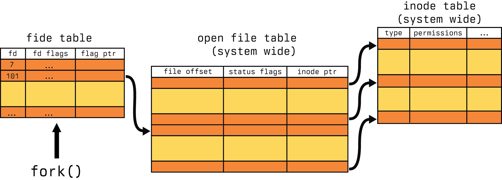

In this example, we are calling `fork()` with an open fide table for a process. This fide table has a reference for file descriptor `101` that has a link to our open file table. Let's assume for a moment this is `abc.txt`. Now after we call fork, let's see what happens.

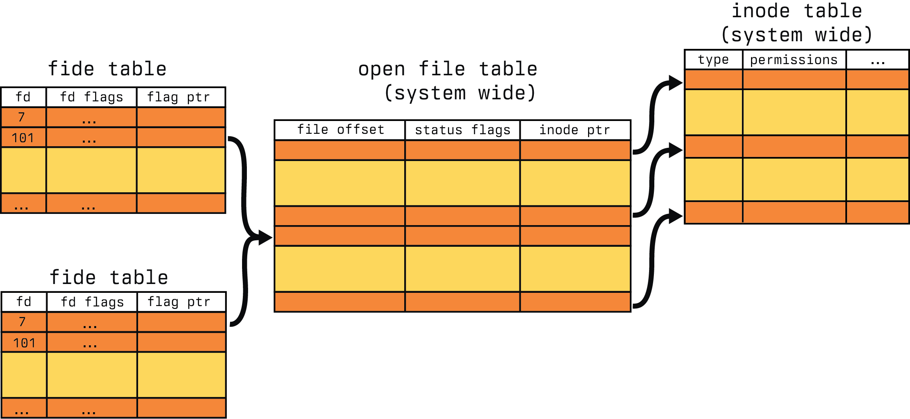

We now have two process fide tables, both of which have the same file descriptor reference `101` pointing to the same entry in the open file table. There are few ways to start a process in Unix, and `fork()` is one of them. `fork()` duplicates the calling process, including the fide table. So now, both process write `"foo"` to the file, ending in the output `"foofoo"`.

But what if we didn't desire that behavior in our program? How do we still fork at that point and prevent the write? This is where `O_CLOEXEC` comes in. Let's modify our program a bit to the following.

<!-- # TODO, modify above program for fork/exec flow -->


In this example, we will `fork()` the process similar to perform, but when we write out the data, the file descriptor will be closed as indicated by the image below.

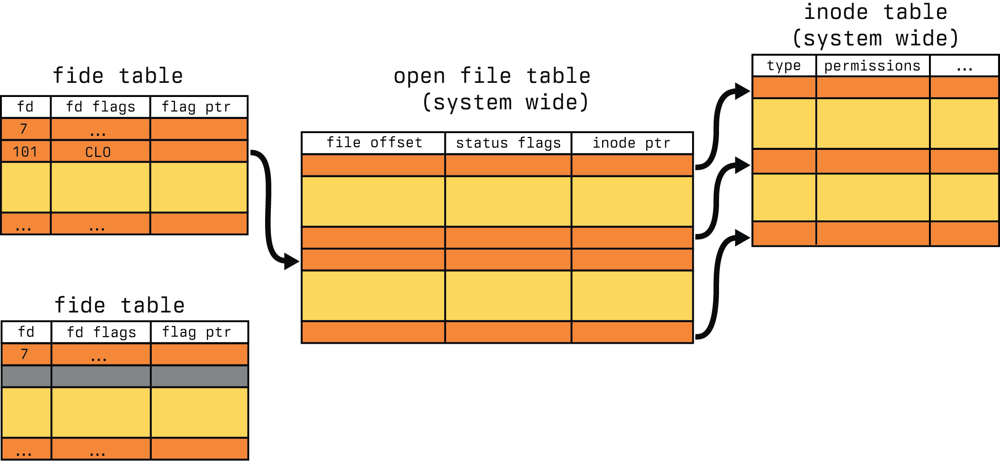

So our writer can not write directly to our file descriptor after the `fork()` which results in the following output of the program.

```bash
; gcc test.c -o a.out
; ./a.out
; cat abc.txt
foofoo
```

# Event triggers

Event triggers, or interrupts, for the purposes of this article will not be related to hardware interrupts. We will instead be taking a simplistic view to eliminate some of the complexities associated with event handling in Linux systems. If you are dissatisfied with this simplification, I would strongly encourage exploring [this article on this Linux networking stack](https://blog.packagecloud.io/monitoring-tuning-linux-networking-stack-receiving-data/). We will be taking a drastically simplified view to explain how they function in one direction. 

## Level triggers

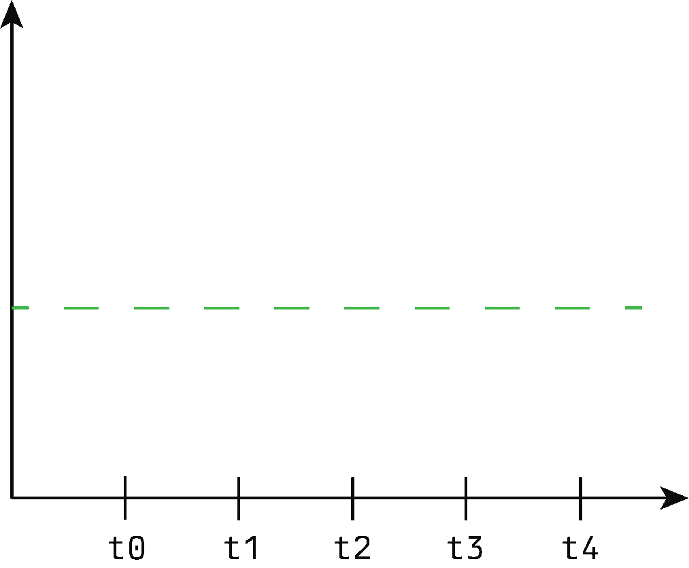

## Edge triggers


# select and poll

`select()` and `poll()`, even in the world of `epoll`, still have their place in the Linux ecosystem. `epoll` introduces a fair bit of management overhead, as we will see, and  

```c
int select(
  int nfds,
  fd_set *readfds,
  fd_set *writefds,
  fd_set *exceptfds,
  struct timeval *timeout
);
```

```c
int poll(
  struct pollfd *fds,
  nfds_t nfds,
  int timeout
);
struct pollfd {
  int fd;
  short int events;
  short int revents;
};
```

# epoll

```c
#include <sys/epoll.h>
int epoll_create(
  int size
);
```

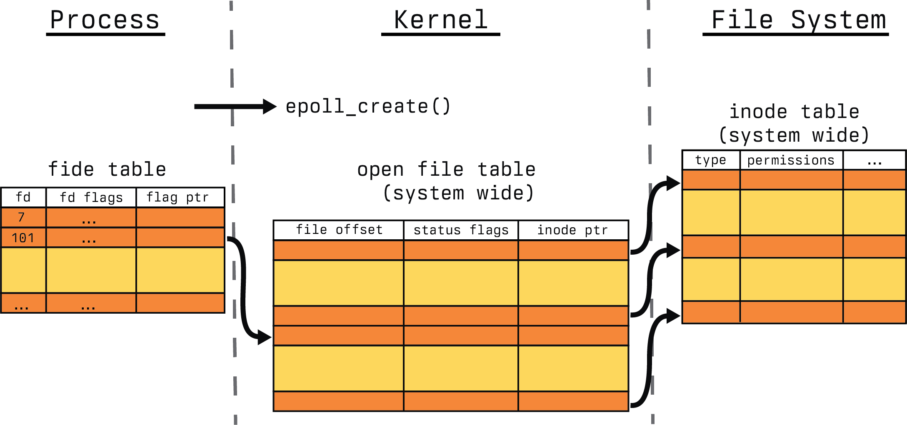

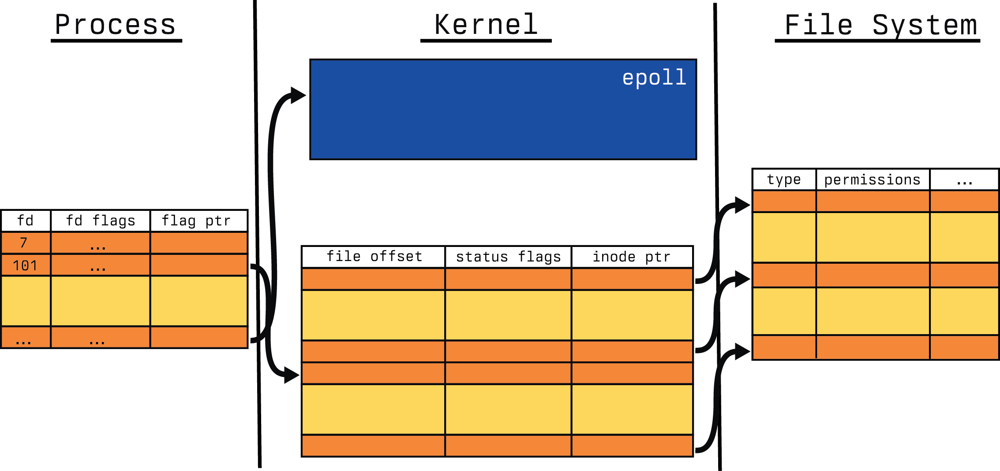

```c
#include <sys/epoll.h>
int epoll_ctl(
  int epfd,
  int op,
  int fd,
  struct epoll_event *event
);
```

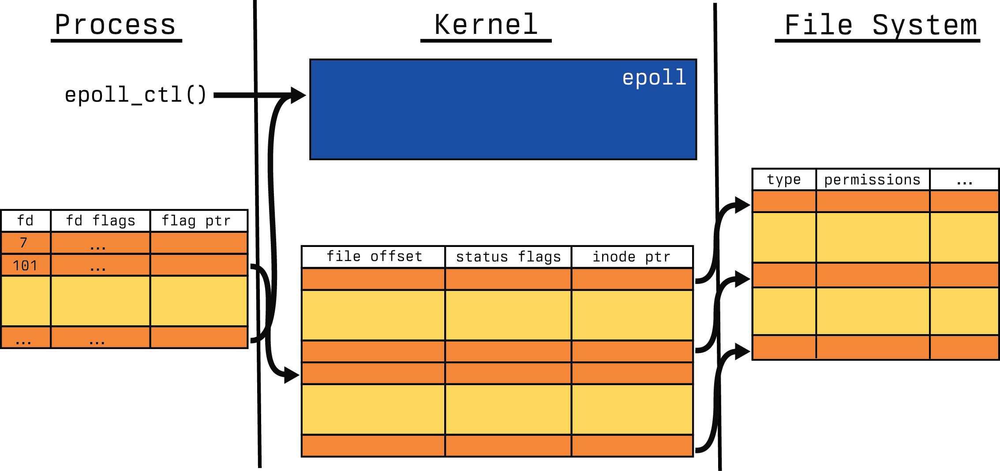

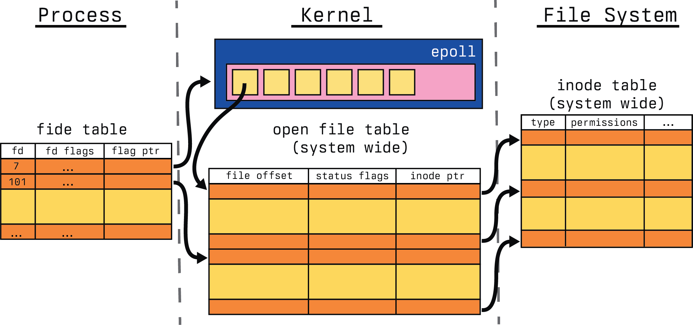

```c
#include <sys/epoll.h>
int epoll_wait(
  int epfd,
  struct epoll_event *evlist,
  int maxevents,
  int timeout
);
```

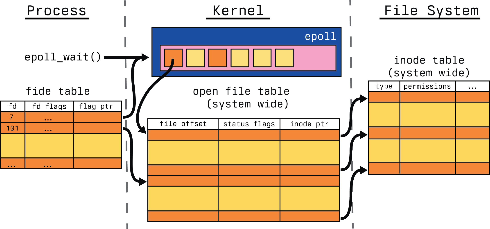

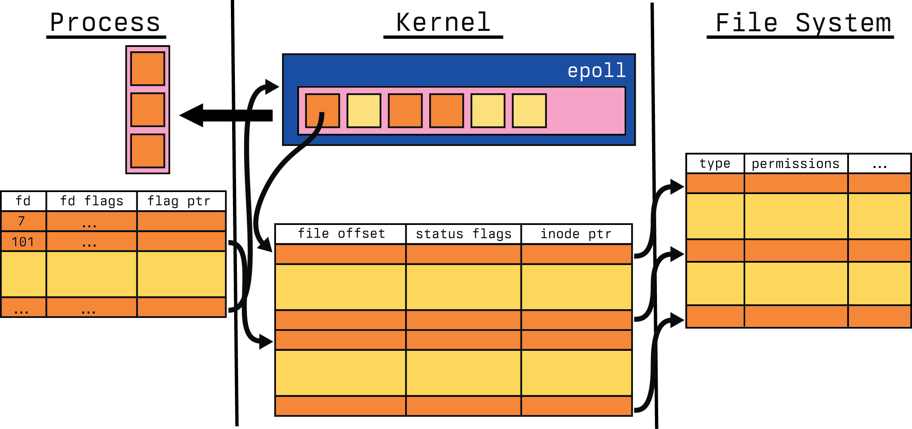

## Performance and pitfalls

# References

1. https://en.wikipedia.org/wiki/Select_%28Unix%29
2. https://en.wikipedia.org/wiki/Poll_(Unix)
3. https://en.wikipedia.org/wiki/Interrupt
4. https://en.wikipedia.org/wiki/File_descriptor
5. https://en.wikipedia.org/wiki/Inode
6. https://medium.com/@copyconstruct/nonblocking-i-o-99948ad7c957
7. https://medium.com/@copyconstruct/the-method-to-epolls-madness-d9d2d6378642
8. https://idea.popcount.org/2017-02-20-epoll-is-fundamentally-broken-12/
9. https://idea.popcount.org/2017-03-20-epoll-is-fundamentally-broken-22/
10. https://jvns.ca/blog/2017/06/03/async-io-on-linux--select--poll--and-epoll/
11. https://kovyrin.net/2006/04/13/epoll-asynchronous-network-programming/
12. http://man7.org/training/download/lusp_fileio_slides.pdf
13. https://www.youtube.com/watch?v=l6XQUciI-Sc
14. https://lwn.net/Articles/13587/
15. https://en.wikipedia.org/wiki/File-system_permissions
16. https://man7.org/linux/man-pages/man2/open.2.html
17. https://darkcoding.net/software/epoll-the-api-that-powers-the-modern-internet/
18. https://www.man7.org/linux/man-pages/man2/accept.2.html
19. https://www.man7.org/linux/man-pages/man2/fork.2.html
20. https://blog.packagecloud.io/monitoring-tuning-linux-networking-stack-receiving-data/
21. https://www.kegel.com/c10k.html
