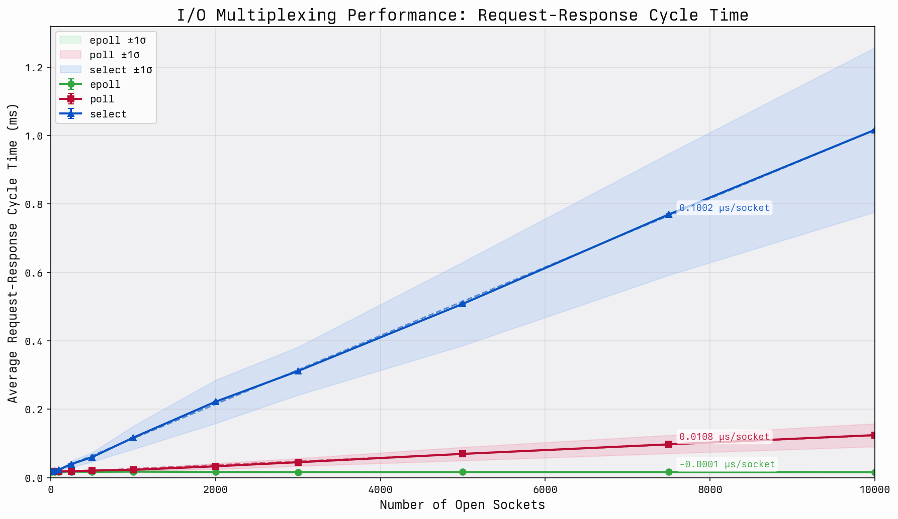

# Introduction

This article is going to be focused on taking a tour through some of the mechanisms of epoll. Let’s start by just giving a brief quote to introduce what epoll is to frame the conversation.

> epoll is a Linux kernel system call for a scalable I/O event notification mechanism (…) Its function is to monitor multiple file descriptors to see whether I/O is possible on any of them.

Which gives us some sense of what we are talking about. But I find that a better way to introduce epoll is to introduce the problem that it solves.

> The classic Unix way to wait for I/O events on multiple file descriptors is with the select() and poll() system calls. When a process invokes one of those calls, the kernel goes through the list of interesting file descriptors, checks to see if non-blocking I/O is available on any of them, and adds the calling process to a wait queue for each file descriptor that would block. This implementation works reasonably well when the number of file descriptors is small. But if a process is managing thousands of file descriptors, the select() and poll() calls must check every single one of them, and add the calling process to thousands of wait queues. For every single call. Needless to say, this approach does not scale very well. [[1]](https://lwn.net/Articles/13587/)

This quote comes from the initial introduction of epoll into the Linux kernel in late 2002. The idea, being rather explicitly outlined, was that watching changes on file descriptors was far too slow at as the count numbered in the thousands. We will discuss why that is done important shortly, but monitoring thousands of file descriptors is one of the foundations of computing today. It’s not uncommon for a single service to get into the tens of thousands of file descriptors. [[2]](https://www.kegel.com/c10k.html) Runtimes that ended up depending on this change, like Node.js, wouldn’t be released until 7 years later, and the foundational event loop for Node.js called [libuv](/blog/libuv) would not be released 2011. It’s not a stretch today to say that epoll is one of the foundations of the internet. [[3]](https://darkcoding.net/software/epoll-the-api-that-powers-the-modern-internet/) In order to understand epoll, the problems it solves and the problems it creates, you have to understand two major ideas: file descriptors and triggering. Let’s start by talking about file descriptors. As with any library, the content in this article may drift towards incorrect over time. This article has been drafted with a lens for Linux `v6.8`. This article will provide an incomplete picture, and if the reader finds themselves wanting for more details, I would encourage diving into the references and linked content, there is a wealth of information in the references section alone.

# File descriptors

There will be two very similar terms that we will be introducing, **file descriptors** and _file descriptions_. It’s very important to note that while these two ideas are related, they represent different concepts. A file description is fundamentally an internal data structure in the linux kernel, we will revisit them momentarily. The important part is **file descriptions are an internal data structure, not to be confused with the more common file descriptors**. We will see why this statement is important later. So what are **file descriptors**?

> In Unix and related computer operating systems, a file descriptor (FD, less frequently fildes) is an abstract indicator (handle) used to access a file or other input/output resource, such as a pipe or network socket. [[4]](https://en.wikipedia.org/wiki/File_descriptor)

That is to say, if you are doing I/O, you are using a file descriptor. File descriptors are process bounded, that is to say that the table that manages file descriptors is mostly unique to a process. This table can be seen below.

```c
struct fdtable {
  unsigned int        max_fds;
  struct file __rcu **fd;
  unsigned long      *close_on_exec;
  unsigned long      *open_fds;
  unsigned long      *full_fds_bits;
  struct              rcu_head rcu;
};
```

We can see some information about the maximum number of file descriptors. We have an array of `file` structures called `fd`, then some extended information about some properties within the file descriptor table. So, how would this get populated with information? Let's start by breaking down the simplest example we can create.

```c
#include <unistd.h>
#include <fcntl.h>
#include <stdio.h>

int main(void) {
  int fd = open("abc.txt", O_RDWR | O_CREAT | O_TRUNC, 0666);
  write(fd, "foo", 3);
  close(fd);
  return 0;
}
```

In this example, we start by opening a file `"abc.txt"`. This file is opened with the permissions `666`, which indicates that the owner, the group and other can all read and write. [[5]](https://en.wikipedia.org/wiki/File-system_permissions) It passes in three flags, representing three ideas: the file is opened in a read/write mode (`O_RDWR`); if the file does not exist, create it as a regular file (`O_CREAT`); if the file already exists and is a regular file, and the access mode allows writing, it will be truncated to length 0 (`O_TRUNC`). We then proceed to immediately write the data `"foo"` to the integer returned from the `open()` call. This integer represents a file descriptor, more specifically a small, nonnegative integer that is an index to an entry in the process's table of open file descriptors. [[6]](https://man7.org/linux/man-pages/man2/open.2.html) We finally wrap up by closing the open file descriptor, and our text file now contains the text `foo`. The question remains though, how do we get from an integer to writing data on a filesystem?

We can start to answer that question with a simplistic view of the world, much like our previous test program. We can break down I/O interactions on Linux into three main components: file descriptors, file tables, and inode tables. Those relationships can be seen here. As a note, we are going to be focused on **file handling in Linux in this section**, a great deal of the concepts apply to pipes and sockets as well, it's just easier to view the world as files.


## File table

File tables are the bridge between the application view of the world and the filesystems view of the world. File tables bridge file descriptors and inodes with information about the mode of access.

> In the traditional implementation of Unix, file descriptors index into a per-process file descriptor table maintained by the kernel, that in turn indexes into a system-wide table of files opened by all processes, called the file table. This table records the mode with which the file (or other resource) has been opened: for reading, writing, appending, and possibly other modes. [[4]](https://en.wikipedia.org/wiki/File_descriptor)

Unfortunately, this model only exists in theory. In reality, there is **no large table that represents the bridge between files**. Instead we have a following structure.

```c
struct file {
  union {
    struct llist_node f_llist;
    struct rcu_head   f_rcuhead;
    unsigned int      f_iocb_flags;
  };

  /*
   * Protects f_ep, f_flags.
   * Must not be taken from IRQ context.
   */
  spinlock_t           f_lock;
  fmode_t              f_mode;
  atomic_long_t        f_count;
  struct mutex         f_pos_lock;
  loff_t               f_pos;
  unsigned int         f_flags;
  struct fown_struct   f_owner;
  const struct cred   *f_cred;
  struct file_ra_state f_ra;
  struct path          f_path;
  struct inode        *f_inode;  /* cached value */
  const struct file_operations  *f_op;

  /* ... skipped */

#ifdef CONFIG_EPOLL
  /* Used by fs/eventpoll.c to link all the hooks to this file */
  struct hlist_head  *f_ep;
#endif /* #ifdef CONFIG_EPOLL */
  struct address_space  *f_mapping;
  errseq_t    f_wb_err;
  errseq_t    f_sb_err; /* for syncfs */
}
```

As you can see from the above, there is some information about the flags for the file, the read ahead state of the file, the position, locks, etc. Rather curiously, there are epoll mechanisms contained within the struct as well. That is to say, there is a fair amount going on with this data structure. This is what is often referred to as a _file description_. This data structure was referenced previous in our process file descriptor table previously. The most important piece I want to call out is the `struct inode` reference in the file. This is the means by which file descriptors are able to reference filesystem elements known as `inodes`. [[21]](https://en.wikipedia.org/wiki/Inode) So what is an inode?

## inode table

An inode is a representation of a file system object. This one of the four major components of most filesystems in Linux. Those four being:

1. superblock
2. inode
3. file
4. dentry

Some filesystems like XFS, ZFS and others don't quite represent the four ideas in the same form as the likes of ext2/3/4 or others. However, they provide a reasonable starting point as the foundational ideas for more filesystems. The formal definition highlights some additional pieces.

> An inode (index node) is a data structure in a Unix-style file system that describes a file-system object such as a file or a directory. Each inode stores the attributes and disk block locations of the object's data. File-system object attributes may include metadata (times of last change, access, modification), as well as owner and permission data. [[7]](https://en.wikipedia.org/wiki/Inode)

However, much like the file table, the inode table doesn't really exist. It's an abstraction, in reality, it's just references. Each filesystem contains it's own version of the inode table, called a superblock. We won't discuss the intricacies of particular file system superblock management here, we will instead stop at the discussing of the `struct inode`.

```c
struct inode {
  umode_t         i_mode;
  unsigned short  i_opflags;
  kuid_t          i_uid;
  kgid_t          i_gid;
  unsigned int    i_flags;

  /* ...skipped */

  const struct inode_operations  *i_op;
  struct super_block             *i_sb;
  struct address_space           *i_mapping;

  /* ...skipped */

  /* Stat data, not accessed from path walking */
  unsigned long    i_ino;
  /*
   * Filesystems may only read i_nlink directly.  They shall use the
   * following functions for modification:
   *
   *    (set|clear|inc|drop)_nlink
   *    inode_(inc|dec)_link_count
   */
  union {
    const unsigned int i_nlink;
    unsigned int       __i_nlink;
  };
  dev_t              i_rdev;
  loff_t             i_size;
  struct timespec64  __i_atime;
  struct timespec64  __i_mtime;
  struct timespec64  __i_ctime; /* use inode_*_ctime accessors! */
  spinlock_t         i_lock;  /* i_blocks, i_bytes, maybe i_size */
  unsigned short     i_bytes;
  u8                 i_blkbits;
  u8                 i_write_hint;
  blkcnt_t           i_blocks;

  /* ...skipped */

  /* Misc */
  unsigned long        i_state;
  struct rw_semaphore  i_rwsem;

  unsigned long    dirtied_when;  /* jiffies of first dirtying */
  unsigned long    dirtied_time_when;

  struct hlist_node  i_hash;
  struct list_head   i_io_list;  /* backing dev IO list */

  /* ...skipped */

  struct list_head  i_lru;    /* inode LRU list */
  struct list_head  i_sb_list;
  struct list_head  i_wb_list;  /* backing dev writeback list */
  union {
    struct hlist_head  i_dentry;
    struct rcu_head    i_rcu;
  };
  atomic64_t    i_version;
  atomic64_t    i_sequence; /* see futex */
  atomic_t      i_count;
  atomic_t      i_dio_count;
  atomic_t      i_writecount;

  /* ...skipped */

  union {
    const struct file_operations  *i_fop;  /* former ->i_op->default_file_ops */
    void (*free_inode)(struct inode *);
  };
  struct file_lock_context  *i_flctx;
  struct address_space       i_data;
  struct list_head           i_devices;
  union {
    struct pipe_inode_info  *i_pipe;
    struct cdev             *i_cdev;
    char                    *i_link;
    unsigned                 i_dir_seq;
  };

  __u32      i_generation;

  /* ...skipped */

  void      *i_private; /* fs or device private pointer */
}
```

Even with the skipped lines of code, there is a fair number of pieces in play within this struct. We have `dentry` references, pipe information, block and bytes information, modification, creation and access times along with semaphores. This would be too much to discuss in one blog article and perhaps one day, I will focus on the interactions of file systems with `struct inode`. For now, when we look at this in practice we are going to break down the concept into smaller pieces that are easier to process.

## File descriptors in practice

There is so much to file descriptors (often referred to as **fide** from here in), file descriptions and inodes, so we are going to simplify them. We are going to break down into the following five reductive statements.

1. We will assume there is a system wide table called the `open file table`, like the file table previously described.
2. We will assume there is a system wide table called the `inode table`, like the inode table previously described.
3. Inodes are comprised of:
   1. type
   2. permissions
4. File descriptions, or file table entries, are comprised of:
   1. file offset
   2. status flags
   3. inode pointers
5. File descriptors are comprised of:
   1. file descriptor id, `fd`
   2. flags
   3. file description pointers, `flag ptr`

These aren't completely outlandish, and give us a reasonable frame of reference to discuss the more important pieces of polling. With that, our view of the world resembles the following.


Now for understanding epoll, there are two additional concepts we need to discuss. Those being `fork()` [[8]](https://www.man7.org/linux/man-pages/man2/fork.2.html) and one of the flags for file descriptors called `O_CLOEXEC`, which stands for Open Close-on-Exec. Let's talk about `fork()` first. We need to extend our simplistic example a bit in order to discuss it. As a brief aside for process management, there are only a handful of ways to actually start a process in Linux, the most common of which are `fork()` and `exec()`. [[9]](https://www.man7.org/linux/man-pages/man3/exec.3.html) It's fairly uncommon to see one without the other, so we will be extend our simple process before and splitting up the opening of file descriptors, and the writing of file descriptors.

Let's start with our parent.

```c
#include <unistd.h>
#include <fcntl.h>
#include <stdio.h>
#include <stdlib.h>

int main(void) {
  int fd = open("abc.txt", O_WRONLY | O_CREAT | O_TRUNC, 0666);

  pid_t pid = fork();
  if (pid == 0) {
    char fd_str[16];
    snprintf(fd_str, sizeof(fd_str), "%d", fd);
    execl("./child", "child", fd_str, NULL);
  }

  write(fd, "foo", 3);
  close(fd);
  return 0;
}
```

And our child function.

```c
#include <unistd.h>
#include <stdlib.h>
#include <stdio.h>

int main(int argc, char *argv[]) {
    int fd = atoi(argv[1]);

    write(fd, "foo", 3);
    close(fd);

    return 0;
}
```

We still have the same basic concept, except in one, the file descriptor is passed. Here is the output from copying that into a file `parent.c` and `child.c` and compiling and running it.

```bash
; gcc parent.c -o test
; gcc child.c -o child
; ./test
; cat abc.txt
foofoo
```

This may be surprising if you have never encountered `fork()` before. But let's see what is going on. When we start, our world view looks kind of like this.

![A diagram of the relationship between process file descriptor tables, file tables and inode tables. It displays three tables of varying colors, one process file descriptor tables and one for the each of the remaining two types. It establishes the major relationships, drawing arrows between shared file descriptors resulting from forks, individual file descriptors and the relationship between file and inode on disk. It additionally has an arrow pointing to the file descriptor table indicating a fork system call](../../assets/epoll/epoll_fork_pre.png "File Descriptor Tables Pre-Fork")

In this example, we are calling `fork()` with an open fide table for a process. This fide table has a reference for file descriptor `101` that has a link to our open file table. Let's assume for a moment this is `abc.txt`. Now after we call fork, let's see what happens.


We now have two process fide tables, both of which have the same file descriptor reference `101` pointing to the same entry in the open file table. So now, both processes write `"foo"` to the file, ending in the output `"foofoo"`.

But what if we didn't desire that behavior in our program? How do we still fork at that point and prevent the write? This is where `O_CLOEXEC` comes in. Let's modify our program a bit to the following.

```c
#include <unistd.h>
#include <fcntl.h>
#include <stdio.h>
#include <stdlib.h>

int main(void) {
  int fd = open("abc.txt", O_WRONLY | O_CREAT | O_TRUNC | O_CLOEXEC, 0666);

  pid_t pid = fork();
  if (pid == 0) {
    char fd_str[16];
    sprintf(fd_str, "%d", fd);
    execl("./child", "child", fd_str, NULL);
  }

  write(fd, "foo", 3);
  close(fd);
  return 0;
}
```

The only thing we have added is a flag `O_CLOEXEC` to our original open call. The child remains the same. So what happens now?

```bash
; gcc cloexec.c -o cloexec
; gcc child.c -o child
; ./cloexec
; cat abc.txt
foo
```

Why did that happen though?

![A diagram of the relationship between process file descriptor tables, file tables and inode tables. It displays three tables of varying colors, one process file descriptor tables and one for the each of the remaining two types. It establishes the major relationships, drawing arrows between shared file descriptors resulting from forks, individual file descriptors and the relationship between file and inode on disk. It additional has an arrow pointing to the file descriptor table indicating a fork system call with a flag set in one of the entries for the file descriptor as CLO](../../assets/epoll/epoll_close_pre.png)

We still start with the same world view as before, only with the change to the _fd flags_ to indicate `CLO`. This represents our `O_CLOEXEC` flag. When we perform our `fork()`, followed by our `exec()` for the child process, the file descriptor becomes gray. As you can imagine, this is our "Close-on-Exec" flag coming into play.

![A diagram of the relationship between process file descriptor tables, file tables and inode tables. It displays four tables of varying colors, two process file descriptor tables and one for the each of the remaining two types. It establishes the major relationships, drawing arrows between shared file descriptors resulting from forks, individual file descriptors and the relationship between file and inode on disk. It has one of the entries gray out in the second file descriptor table, this has a counterpart in the first table where a CLO flag has been set](../../assets/epoll/epoll_close_post.png)

So our writer can not write directly to our file descriptor after the `exec()` which results in the text `"foo"` only being written in the parent process, not in the child. So why is this important for epoll? Well, there is a rather serious design flaw in epoll that requires special case handling. Since epoll registers the _file description_, not the **file descriptor**, you need careful handling to avoid sharing epoll-registered file descriptors in `exec()` or `dup()` calls. You could perform careful defensive programming with our `O_CLOEXEC`, or you can use the `EPOLLEXCLUSIVE` flag. Which is all to say, be wary about file descriptor management with epoll, as we will see later, it is a kernel space structure and does not directly interact with the process file table through the use of descriptors.

So, while we have looked at the intricacies of the pieces that make up this diagram, and a simple example that writes to a file, it begs the question, what would a real interaction look like? The following is an example of a simple HTTP server that helps to better illustrate a real world use case.

```c
void server_serve(server_t **server) {
  struct sockaddr_storage their_addr;
  socklen_t socket_in_size;
  long connection_count = 0;
  int incoming;

  server_bind(server);
  server_listen(server);

  while(1) {
    socket_in_size = sizeof(their_addr);
    incoming = accept((*server)->fdsocket, (struct sockaddr *)&their_addr, &socket_in_size);
    if (incoming == -1) {
      fprintf(stderr, "%s @ %d: failed to accept incoming connection, error: %s\n", __FILE__, __LINE__, strerror(errno));
      continue;
    }

    context_t* incomingctx;
    incomingctx = malloc(sizeof(context_t));

    incomingctx->id = connection_count;
    incomingctx->fdincoming = incoming;
    incomingctx->server = server;
    incomingctx->hstart = time(NULL);

    connection_count++;

    server_parseheader(&incomingctx);
    if (incomingctx->error != None) {
      switch (incomingctx->error) {
        case ClientClosedError:
          server_sendheader(&incomingctx, ERROR, 0);
          break;
        case RecvError:
          server_sendheader(&incomingctx, ERROR, 0);
          break;
        case HeaderParseError:
          server_sendheader(&incomingctx, INVALID, 0);
          break;
        default:
          server_sendheader(&incomingctx, ERROR, 0);
          break;
      }
      server_abort(&incomingctx);
    } else {
      long fstart = time(NULL);
      incomingctx->fstart = fstart;
      if((*server)->handler(&incomingctx, incomingctx->path, (*server)->arg) < 0) {
        fprintf(stderr, "%s @ %d: request failed, error: %s\n", __FILE__, __LINE__, strerror(errno));
        continue;
      }

      client_wait(incoming, fstart, connection_count);
      close(incoming);
      if (incomingctx != NULL) {
        free(incomingctx);
      }
    }
  }
}
```

In the above, we use file descriptors at the start of the while loop as part of the `accept()` [[10]](https://www.man7.org/linux/man-pages/man2/accept.2.html) call. We previously have established a file descriptor for the socket handling in the `server_bind` which has been truncated for brevity sake. From there, we accept an incoming connection on that file descriptor for the socket, given by `(*server)->fdsocket`. That incoming file descriptor is then used in the `incomingctx` and passed as the `fdincoming`. From there, we are able to pass that off to our server handler who has enough information on the `incomingctx` reference to proceed. For all intents and purposes, this is basically how every HTTP server in the world works, you bind to a socket, accept incoming connections, pass off the connection to a handler who has the responsibility and passing the requisite information. But here is a perplexing question, how do we know that a socket has an incoming connection?

# Event triggers

We notify programs that files and sockets have received information through interrupt requests. Interrupt Requests, or IRQs, are often broken into two classes, what is called a hard IRQ and what is called a soft IRQ. [[20]](https://en.wikipedia.org/wiki/Interrupt_request). We will be primarily focused on the **interface for constructing hard IRQs for firing soft IRQ tasklets**, and will ignore some of the mechanisms for creating soft IRQ tasklets and **focus exclusively on hardware triggers**. If you are dissatisfied with this simplification, I would strongly encourage exploring [this article on this Linux networking stack](https://blog.packagecloud.io/monitoring-tuning-linux-networking-stack-receiving-data/) and [this presentation on IRQs](https://events.static.linuxfound.org/sites/events/files/slides/Chaiken_ELCE2016.pdf). So let's isolate this section to answering the following question.

> How does a inode know it has data ready to read from it's file descriptor?

The answer to this question fundamentally boils down to trigger mechanisms. There are two classes of triggers in the IRQ space, level and edge triggers. Both have their respective use cases, here is a grab bag of example use cases that also rely on epoll:

- Level Triggers
  - [Redis](https://github.com/redis/redis/blob/8.4.1/src/ae_epoll.c)
  - [Node.js](https://github.com/libuv/libuv/blob/v1.x/src/unix/linux.c)
- Edge Triggers
  - [Nginx](https://github.com/nginx/nginx/blob/stable-1.28/src/event/modules/ngx_epoll_module.c)
  - [Golang](https://github.com/golang/go/blob/go1.25.7/src/runtime/netpoll_epoll.go)

Level triggers are used when you can't consume all the data in the descriptor and you want to keep triggering while data is available. There are several disadvantages to this discussed in more detail in the linked pitfalls articles. Edge triggers only notify as write ready once, which often means that you need to pull at the data into user space. Edge triggers are useful in multicore machines where multiple threads can wait on the same file descriptor as only one will wake to handle it.

## Level triggers

Level triggers are triggers that stay asserted until the device clears the interrupt condition. This is pretty easy to visualize, let's say that we have a line where we indicate that we are at a high logical level, and anything below that line is a low logic level. Our interrupt conditions might look like the following.


Of course, this is not how hardware interrupts work in practice, mostly because drivers don't assign an arbitrary number of bytes to determine when a file is ready. But it is a close approximation to the actual high and low logic levels that cause hard IRQs in the device drivers, and it's much easier to visualize. As you can see in the gif, our interrupts only fire when we exceed our arbitrary line. When you start to apply this to hardware, which tends to think in a more binary state, you can start see where an issue for performance starts to arise. When a read or write event occurs on the monitored file descriptor and you don’t read or write all the data at once, then the interrupt request will keep firing.

## Edge triggers

Edge-triggered are triggers that generate an interrupt only on transitions of the signal. These could be [rising or falling signals depending on the flags passed.](https://github.com/torvalds/linux/blob/v6.8/include/linux/interrupt.h#L30-L37). So let's look at an example visualization where we only notify on rising.


As you can see, each time data is added, we notify, but we don't notify for reading. Again, this is a simplification of the hardware process as they often rely on binary views of the world, so if the driver has not reset a high logic state, even if more data is written it is not guaranteed to produce an interrupt. This is because we only notify on the rising edge, so if we start with data, then we only read part, or we get more write data, that is not a change in the logical state. You get less notifications in this state, but you have to perform more "remembering" of ready file descriptors as a trade-off.

# I/O Polling

As you may already be aware, performing I/O is one of the major values of a computer. I have a saying that I often refer to, I don't know the origination but it amounts to the following:

> "Computers were perfect until we connected them together and let them talk".

However, I also recognize that computers would not be near as popular as they are today if they couldn't talk to eachother. So if we know what tracks events, and how events are triggered, how do we notify programs that they need to do something with these events? This is where the I/O polling syscalls come into play.

## select and poll

Before we start to talk about epoll, we need to discuss it's precursor `select()` and `poll()`. We will start by exploring `select()`.

> select is a system call and application programming interface (API) in Unix-like and POSIX-compliant operating systems for examining the status of file descriptors of open input/output channels. [[11]](https://en.wikipedia.org/wiki/Select_%28Unix%29)

`select()` is a system call for synchronous I/O multiplexing. Let's break that statement down a bit. We start with the word "synchronous", which is rather obviously counter to the asynchronous nature of Node.js and generally the nature of epoll. However, `select()` was one of the very first I/O management system calls, and as such, did not have anywhere near the same scale of problem that computing had today. It was introduced in 4.2BSD Unix in 1983! [[12]](https://daniel.haxx.se/docs/poll-vs-select.html) The second half of that original statement, **multiplexing**, refers to the idea of taking multiple signals and producing a single signal from them.

> In computing, I/O multiplexing can also be used to refer to the concept of processing multiple input/output events from a single event loop, with system calls like poll and select (Unix). [[13]](https://en.wikipedia.org/wiki/Multiplexing)

To rephrase our original definition. `select()` is a system call that will handle multiple I/O events and produce one event for processing when called. So, what does this call end up looking like?

```c
int select(
  int nfds,
  fd_set *readfds,
  fd_set *writefds,
  fd_set *exceptfds,
  struct timeval *timeout
);
```

This interface highlights a few interesting ideas. The first is the use of file descriptors, in read, write and exception modes. Read and write make sense, but what's an _exceptional mode_? Generally, exceptional modes break down into the following ideas:

- There is out-of-band data on a TCP socket [[14]](https://www.man7.org/linux/man-pages/man7/tcp.7.html)
- A pseudoterminal boss in packet mode has seen a state change on the worker [[15]](https://www.man7.org/linux/man-pages/man2/ioctl_tty.2.html)
- A cgroup.events file has been modified [[16]](https://www.man7.org/linux/man-pages/man7/cgroups.7.html)

We won't really discuss those ideas in more detail. I encourage perusing the man pages if you have follow up questions here. With that being said, I feel that's insufficient to describe select in detail. I try to make a habit of exploring code more deeply than just the interface layer, so let's try to break down more clearly what is happening.

```c
static int do_select(int n, fd_set_bits *fds, struct timespec64 *end_time) {

  /* ...initialization code */

  rcu_read_lock();
  retval = max_select_fd(n, fds);
  rcu_read_unlock();

  if (retval < 0)
    return retval;
  n = retval;

  /* ...timeout handling */

  retval = 0;
  for (;;) {
    unsigned long *rinp, *routp, *rexp, *inp, *outp, *exp;
    bool can_busy_loop = false;

    inp = fds->in; outp = fds->out; exp = fds->ex;
    rinp = fds->res_in; routp = fds->res_out; rexp = fds->res_ex;

    for (i = 0; i < n; ++rinp, ++routp, ++rexp) {
      unsigned long in, out, ex, all_bits, bit = 1, j;
      unsigned long res_in = 0, res_out = 0, res_ex = 0;
      __poll_t mask;

      in = *inp++; out = *outp++; ex = *exp++;
      all_bits = in | out | ex;
      if (all_bits == 0) {
        i += BITS_PER_LONG;
        continue;
      }

      for (j = 0; j < BITS_PER_LONG; ++j, ++i, bit <<= 1) {
        struct fd f;
        if (i >= n)
          break;
        if (!(bit & all_bits))
          continue;
        mask = EPOLLNVAL;
        f = fdget(i);
        if (f.file) {
          wait_key_set(wait, in, out, bit,
                 busy_flag);
          mask = vfs_poll(f.file, wait);

          fdput(f);
        }

        /* ...flag handling */

        /* got something, stop busy polling */
        if (retval) {
          can_busy_loop = false;
          busy_flag = 0;
        }
        /* ...busy handling */

      }
      if (res_in)
        *rinp = res_in;
      if (res_out)
        *routp = res_out;
      if (res_ex)
        *rexp = res_ex;
      cond_resched();
    }

    wait->_qproc = NULL;
    if (retval || timed_out || signal_pending(current))
      break;
    if (table.error) {
      retval = table.error;
      break;
    }

    /* ...timeout handling */

  }

  poll_freewait(&table);

  return retval;
}
```

Note, a great deal of the code has been truncated to focus the conversation. As a fun fact, the last time this section of code, that was pulled from the `v6.8` kernel, was touched 5 years ago. There has been [one change since then which you can see here](https://github.com/torvalds/linux/commit/d000e073ca2a08ab70accc28e93dee8d70e89d2f), that change however, makes it harder to talk about the single function, so we will stick with `v6.8`. This function highlights why `select()` has failed to scale. `select()` will iterate one by one over the file descriptor space passed in and use that to determine if eventing has occurred. It uses the `retval = max_select_fd(n, fds)` to determine the number of file descriptors to loop over, then passed that to the top loop: `for (i = 0; i < n; ++rinp, ++routp, ++rexp) {`. This has the rather unfortunate problem that it is based on a bitset, so if we wanted to watch file descriptor `1` and `20`, we would likely pass the range from `1 -> 20`. From there, it determines the file descriptor to read, and it determines whether event handling notification is required.

```c
  /* ...truncated */
  f = fdget(i);
  if (f.file) {
    wait_key_set(wait, in, out, bit,
            busy_flag);
    mask = vfs_poll(f.file, wait);

    fdput(f);
  }
  /* ...truncated */
```

How does this compare to it's newer counterpart `poll()`? `poll()` was introduced in SVR3 Unix in 1987. [[12]](https://daniel.haxx.se/docs/poll-vs-select.html) And it generally functions very similarly to `select()`. It is also a I/O multiplexing mechanism, but it has one major advantage over `select()` performs far better on sparse. The problem with `select()` was that the way you interacted with it was by giving it bitsets. Those bitsets meant that you enumerated file descriptors that you might not actually be interested processing. `poll()` improves upon this by allowing you to pass an interest list, so the scan over the bitset becomes unnecessary. This is demonstrated in the interface.

```c
int poll(
  struct pollfd *fds,
  nfds_t nfds,
  int timeout
);

struct pollfd {
  int fd;
  short int events;
  short int revents;
};
```

The bitsets are gone, it's just an array of structures that represent the file descriptor we want to watch, the events we want to watch and the requested events. Which is perhaps another important change from the `select()` predecessor, we do not need to repopulate the bitmasks on each call because `poll()` does not destroy the input data like `select()` does. But let's dig in a bit more.

```c
static int do_poll(struct poll_list *list, struct poll_wqueues *wait, struct timespec64 *end_time) {

  /* ...initialization */

  /* Optimise the no-wait case */
  if (end_time && !end_time->tv_sec && !end_time->tv_nsec) {
    pt->_qproc = NULL;
    timed_out = 1;
  }

  /* ... timeout handling */

  for (;;) {
    struct poll_list *walk;
    bool can_busy_loop = false;

    for (walk = list; walk != NULL; walk = walk->next) {
      struct pollfd * pfd, * pfd_end;

      pfd = walk->entries;
      pfd_end = pfd + walk->len;
      for (; pfd != pfd_end; pfd++) {
        /*
         * Fish for events. If we found one, record it
         * and kill poll_table->_qproc, so we don't
         * needlessly register any other waiters after
         * this. They'll get immediately deregistered
         * when we break out and return.
         */
        if (do_pollfd(pfd, pt, &can_busy_loop,
                busy_flag)) {
          count++;
          pt->_qproc = NULL;
          /* found something, stop busy polling */
          busy_flag = 0;
          can_busy_loop = false;
        }
      }
    }
    /*
     * All waiters have already been registered, so don't provide
     * a poll_table->_qproc to them on the next loop iteration.
     */
    pt->_qproc = NULL;
    if (!count) {
      count = wait->error;
      if (signal_pending(current))
        count = -ERESTARTNOHAND;
    }
    if (count || timed_out)
      break;

    /* ...busy loop handling */

    busy_flag = 0;

    /* ...timeout handling */

  }
  return count;
}
```

This is a lot like the `do_select()` function. We are doing a linear scan of arguments, the only change is that we do not do any bitset management for determining file descriptors to scan. We just iterate over the list we were initially passed. However, both `select()` and `poll()` has the same problem, they are linear in time. This is a serious problem as the number of watched file descriptors start to grow. Which is where epoll steps in.

## epoll

epoll is not represented by a single interface, in fact, it's three separate interfaces. As a general note for this section, unlike the previous section, we will be stopping at the interface level for most functions. The functions here are not as contained as `poll()` and `select()` and often branch into other areas. So focusing on the interfaces, they are:

- `epoll_create()` which is responsible for opening the epoll file descriptor [[17]](https://www.man7.org/linux/man-pages/man2/epoll_create.2.html)
- `epoll_ctl()` which is a control interface for the epoll file descriptor [[18]](https://www.man7.org/linux/man-pages/man2/epoll_ctl.2.html)
- `epoll_wait()` which is responsible for waiting for an I/O event on an epoll file descriptor [[19]](https://www.man7.org/linux/man-pages/man2/epoll_wait.2.html)

If you notice, that really only talks about one file descriptor, so how does one file descriptor manage thousands of other file descriptors? The answer is that epoll is not just a system call, it's actually a data structure in the kernel. This data structure is given by the following.

```c
struct eventpoll {
  /*
    * This mutex is used to ensure that files are not removed
    * while epoll is using them. This is held during the event
    * collection loop, the file cleanup path, the epoll file exit
    * code and the ctl operations.
    */
  struct mutex mtx;

  /* Wait queue used by sys_epoll_wait() */
  wait_queue_head_t wq;

  /* Wait queue used by file->poll() */
  wait_queue_head_t poll_wait;

  /* List of ready file descriptors */
  struct list_head rdllist;

  /* Lock which protects rdllist and ovflist */
  rwlock_t lock;

  /* RB tree root used to store monitored fd structs */
  struct rb_root_cached rbr;

  /*
    * This is a single linked list that chains all the "struct epitem" that
    * happened while transferring ready events to userspace w/out
    * holding ->lock.
    */
  struct epitem *ovflist;

  /* wakeup_source used when ep_scan_ready_list is running */
  struct wakeup_source *ws;

  /* The user that created the eventpoll descriptor */
  struct user_struct *user;

  struct file *file;

  /* used to optimize loop detection check */
  u64 gen;
  struct hlist_head refs;

  /*
    * usage count, used together with epitem->dying to
    * orchestrate the disposal of this struct
    */
  refcount_t refcount;

  /* ...skipped */
};
```

Note the use of `struct file` here and not the file descriptor. We are in kernel space now, not user space. We can create that data structure is created from by using the first interface: `epoll_create()`.

```c
#include <sys/epoll.h>
int epoll_create(
  int size
);
```

The size argument is an indication to the kernel about the number of file descriptors a process wants to monitor, which helps the kernel to decide the size of the epoll instance. Since Linux 2.6.8, this argument is ignored because the epoll data structure dynamically resizes as file descriptors are added or removed from it. So let's talk a visual look at what happens when we call it.


The system call returns a file descriptor to the newly created epoll kernel data structure. The calling process can then use this file descriptor to add, remove or modify other file descriptors it wants to monitor for I/O to the epoll instance.


This file descriptor that has been returned can now be modified with the second in our syscall list, `epoll_ctl()`.

```c
#include <sys/epoll.h>
int epoll_ctl(
  int epfd,
  int op,
  int fd,
  struct epoll_event *event
);
```

Going through the arguments, `epfd` is the file descriptor for the epoll data structure, `fd` is the file descriptor we want to add to the epoll list, `o` refers to the operation to be performed on the file descriptor and `event` is a pointer to a structure which stores the event we actually want to monitor for. In general, three operations are supported for the `op`:

- `EPOLL_CTL_ADD` which registers fd with the epoll instance and get notified about events that occur on fd
- `EPOLL_CTL_DEL` which deregisters the fd from the epoll instance. An important note is that if a file descriptor has been added to multiple epoll instances, then closing it will remove it from all of the epoll interest lists to which it was added.
- `EPOLL_CTL_MOD` which modifies the events epoll is monitoring on the fd.

So let's look at a simple example where we add a bunch of file descriptors to be modified.


We generally start with the `epoll_ctl()` call on the epoll data structure, in this case, we call with several `EPOLL_CTL_ADD`.


And then afterwards, our internal epoll data structure has been populated with the requisite file descriptors. So now, we need to know which file descriptors have the events that we are interested in, which brings us to the final syscall interface, `epoll_wait()`.

```c
#include <sys/epoll.h>
int epoll_wait(
  int epfd,
  struct epoll_event *evlist,
  int maxevents,
  int timeout
);
```

Iterating through the arguments again, `epfd` is the file descriptor for the epoll data structure, `evlist` is an array of structures allocated by the calling process and populated by epoll, this is also called the ready list. `maxevents` is the length of `evlist` and `timeout` specifies how long we should block for. Some possibilities here are:

- When the timeout is set to 0, `epoll_wait()` does not block but returns immediately after checking which file descriptors in the interest list for `epfd` are ready
- When timeout is set to -1, `epoll_wait()` will block "forever". By "forever", `epoll_wait()` will block until one of the file descriptors becomes ready or a call is interrupted by a signal handler.
- When timeout is positive and non-zero, it will block until any of the conditions in the negative case, or the timeout expires.

The return code in the non-error case is the number of file descriptors that are ready, which is bounded by `maxevents`. So let's continue our visualization example.


We start with a simple wait call on our file descriptors, none of which have deviated from the state that we added them with.


However, after the call finishes, we have several file descriptors ready from our available list and those have been returned to the process for handling. This is the one point in this subsection we have to dive into the code. Let's look more closely at what is happening here.

```c
static int ep_poll(struct eventpoll *ep, struct epoll_event __user *events, int maxevents, struct timespec64 *timeout) {
  /* ... initialization */

  lockdep_assert_irqs_enabled();

  /* ...timeout */

  /*
   * This call is racy: We may or may not see events that are being added
   * to the ready list under the lock (e.g., in IRQ callbacks). For cases
   * with a non-zero timeout, this thread will check the ready list under
   * lock and will add to the wait queue.  For cases with a zero
   * timeout, the user by definition should not care and will have to
   * recheck again.
   */
  eavail = ep_events_available(ep);

  while (1) {
    if (eavail) {
      /*
       * Try to transfer events to user space. In case we get
       * 0 events and there's still timeout left over, we go
       * trying again in search of more luck.
       */
      res = ep_send_events(ep, events, maxevents);
      if (res)
        return res;
    }

    /* ... timeout, signal handling */

    /*
     * Internally init_wait() uses autoremove_wake_function(),
     * thus wait entry is removed from the wait queue on each
     * wakeup. Why it is important? In case of several waiters
     * each new wakeup will hit the next waiter, giving it the
     * chance to harvest new event. Otherwise wakeup can be
     * lost. This is also good performance-wise, because on
     * normal wakeup path no need to call __remove_wait_queue()
     * explicitly, thus ep->lock is not taken, which halts the
     * event delivery.
     *
     * In fact, we now use an even more aggressive function that
     * unconditionally removes, because we don't reuse the wait
     * entry between loop iterations. This lets us also avoid the
     * performance issue if a process is killed, causing all of its
     * threads to wake up without being removed normally.
     */
    init_wait(&wait);
    wait.func = ep_autoremove_wake_function;

    write_lock_irq(&ep->lock);
    /*
     * Barrierless variant, waitqueue_active() is called under
     * the same lock on wakeup ep_poll_callback() side, so it
     * is safe to avoid an explicit barrier.
     */
    __set_current_state(TASK_INTERRUPTIBLE);

    /*
     * Do the final check under the lock. ep_scan_ready_list()
     * plays with two lists (->rdllist and ->ovflist) and there
     * is always a race when both lists are empty for short
     * period of time although events are pending, so lock is
     * important.
     */
    eavail = ep_events_available(ep);
    if (!eavail)
      __add_wait_queue_exclusive(&ep->wq, &wait);

    write_unlock_irq(&ep->lock);

    if (!eavail)
      timed_out = !schedule_hrtimeout_range(to, slack,
                    HRTIMER_MODE_ABS);
    __set_current_state(TASK_RUNNING);

    /*
     * We were woken up, thus go and try to harvest some events.
     * If timed out and still on the wait queue, recheck eavail
     * carefully under lock, below.
     */
    eavail = 1;

    if (!list_empty_careful(&wait.entry)) {
      write_lock_irq(&ep->lock);
      /*
       * If the thread timed out and is not on the wait queue,
       * it means that the thread was woken up after its
       * timeout expired before it could reacquire the lock.
       * Thus, when wait.entry is empty, it needs to harvest
       * events.
       */
      if (timed_out)
        eavail = list_empty(&wait.entry);
      __remove_wait_queue(&ep->wq, &wait);
      write_unlock_irq(&ep->lock);
    }
  }
}
```

Let's break down this code. We start by checking if IRQs, also known as interrupt requests, are even enabled. This is uncommon to not be enabled, but epoll will not function without it as there will be no triggers. We then check if any events are availabe, which is done through a read of the `rdllist` in the `eventpoll` structure and then a verification of the `ovflist`. If there are events available, we are going to try and transfer them from kernel space to user space. We do this by determining if the event on the entry in the ready list intersects with the requested event, in a thread safe manner. That's going to be the majority of the functionality, afterwards, we perform some additional scans of the available list and finally some time out management towards the end of the function.

## Performance and pitfalls

So just how well has epoll handled the C10K problem? In the Linux Programming Interface by Michael Kerrisk, there is the following table that describes the performance of epoll.

| # operations | poll | select | epoll |
| ------------ | ---- | ------ | ----- |
| 10           | 0.61 | 0.73   | 0.41  |
| 100          | 2.9  | 3.0    | 0.42  |
| 1000         | 35   | 35     | 0.53  |
| 10000        | 990  | 930    | 0.66  |

As part of this blog, I endeavored to recreate this benchmark for a more modern kernel, as these benchmarks were derived for `v2.6.x`. Before we get into these graphs, I want to talk about the methodology here. The benchmark suite was a UDP based echo client-server architecture, where each benchmark suite utilized the same echo server. The server and client would be given:

- A number of file descriptors (`N`) to open
- A number of requests (`R`) per file descriptor to run
- A number of warmup requests (`W`) to ignore.

For each file descriptor, there would be one open socket simulating a watched file descriptor. Only a portion of the file descriptors were active, these were clamped at a minimum of 10, and a maximum of 10% of the `N`. Each active socket was required to perform `R` requests. The server would handle them in kind, and respond asynchronously. The client would then watch the file descriptors and ascertain readiness. The benchmark did not include the construction of the sockets, nor the number of warmup requests `W`. The measured output is the mean time per request as a function of `N`, with the variance calculated using the Welford Variance algorithm with the Bessel correction. As an additional note, in order to circumvent the `FD_SETSIZE` limit in glibc, for the select implementation, there was a dynamic fd set constructed for managing the possible enumerable `select()` bitsets. This is generally not a smart way to use `select()`, but for the purposes of this benchmark, it was a reasonable enough approach to exceed the limits.



The dominant players in this graph are going to be `select()` and `poll()`. We can clearly see that both scale linearly, but the gap between the scale factors is rather wide. This is due to the sparse file descriptor space as part of the bounds of the benchmark. In dense file descriptor spaces, `select()` and `poll()` perform identically. The least interesting portion of the graph is a near linear performance in the case of epoll. Although it seems linear, the performance of epoll is technically going to be _O(log(n))_ because we delete and add file descriptors as part of each request handle, which is reasonably similar to how most systems would perform. The network request duration unfortunately far outweighs the performance impact of the file descriptor add and deletion at this scale. As we start to get progressively larger monitored file descriptor spaces, clamping at 90% instead of 10% active, and extend beyond the 10,000 limit, we start to observe the impact a bit more, but are still bound by the dominance of the network.


Even though the performance benchmarks tell a great story, there are handful of fundamental problems in epoll that required special edge case handling in order to make the system viable. I talked about one of the cases in the file descriptors section. These are discussed in better detail than I can present in the following posts and videos, I highly encourage them for those interested in understanding the pitfalls of epoll even deeper.

1. [Epoll is fundamentally broken 1/2](https://idea.popcount.org/2017-02-20-epoll-is-fundamentally-broken-12/)
2. [Epoll is fundamentally broken 2/2](https://idea.popcount.org/2017-03-20-epoll-is-fundamentally-broken-22/)
3. [Ubuntu Slaughters Kittens | BSD Now 103](https://www.youtube.com/watch?v=l6XQUciI-Sc&t=3364s)

# Summary

This article, and it's related articles, started as a teach out session around early-2020 for developers interested in starting to develop in Node.js. The goal was to teach the intricacies of the platform in a way that broke down a complex asynchronous event system, into a digestible procedural based approach. epoll has far more depth than we were able to explore here, but I hope the relationships between file descriptors, triggers and the various I/O polling mechanisms seems a bit more approachable now. If you are still interested in reading more about this, I would encourage reading the following linked articles which helped solidify my understanding.

1. [Nonblocking I/O](https://medium.com/@copyconstruct/nonblocking-i-o-99948ad7c957)
2. [The method to epoll’s madness](https://medium.com/@copyconstruct/the-method-to-epolls-madness-d9d2d6378642)
3. [Async IO on Linux: select, poll, and epoll](https://jvns.ca/blog/2017/06/03/async-io-on-linux--select--poll--and-epoll/)
4. [Using epoll() for Asynchronous Network Programming](https://kovyrin.net/2006/04/13/epoll-asynchronous-network-programming/)
5. [Monitoring and Tuning the Linux Networking Stack: Receiving Data](https://blog.packagecloud.io/monitoring-tuning-linux-networking-stack-receiving-data/)
6. [Mastering epoll: The Engine Behind High-Performance Linux Networking](https://medium.com/@m-ibrahim.research/mastering-epoll-the-engine-behind-high-performance-linux-networking-85a15e6bde90)

# References

1. https://lwn.net/Articles/13587/
2. https://www.kegel.com/c10k.html
3. https://darkcoding.net/software/epoll-the-api-that-powers-the-modern-internet/
4. https://en.wikipedia.org/wiki/File_descriptor
5. https://en.wikipedia.org/wiki/File-system_permissions
6. https://man7.org/linux/man-pages/man2/open.2.html
7. https://en.wikipedia.org/wiki/Inode
8. https://www.man7.org/linux/man-pages/man2/fork.2.html
9. https://www.man7.org/linux/man-pages/man3/exec.3.html
10. https://www.man7.org/linux/man-pages/man2/accept.2.html
11. https://en.wikipedia.org/wiki/Select_%28Unix%29
12. https://daniel.haxx.se/docs/poll-vs-select.html
13. https://en.wikipedia.org/wiki/Multiplexing
14. https://www.man7.org/linux/man-pages/man7/tcp.7.html
15. https://www.man7.org/linux/man-pages/man2/ioctl_tty.2.html
16. https://www.man7.org/linux/man-pages/man7/cgroups.7.html
17. https://www.man7.org/linux/man-pages/man2/epoll_create.2.html
18. https://www.man7.org/linux/man-pages/man2/epoll_ctl.2.html
19. https://www.man7.org/linux/man-pages/man2/epoll_wait.2.html
20. https://en.wikipedia.org/wiki/Interrupt_request
21. https://en.wikipedia.org/wiki/Inode
