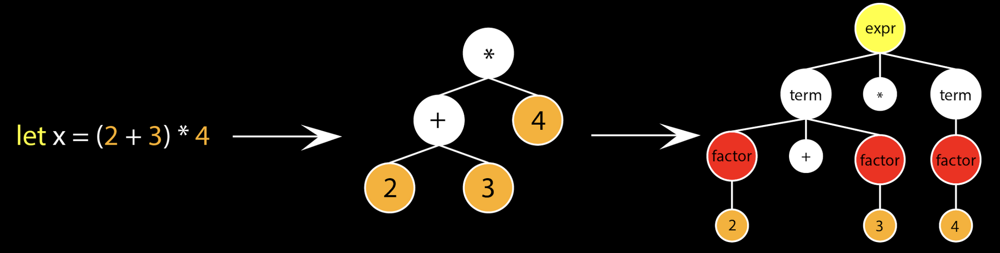

# Introduction

This article is going to be exploring a subset of the mechanisms of v8. [[1]](https://v8.dev/docs) I wanted to use a quote to set the tone for this article. The quote comes from Kernighan and Plauger in their book _Elements of Programming Style_.

> “Trying to outsmart a compiler defeats much of the purpose of using one.”

For those familiar with compilers, this is going to resonate with you immediately. Compilers are sophisticated pieces of technology and people spend a great deal of time optimizing them. I am reminded of a recent post on Twitter regardless optimizing loops with branchless programming. The author claimed that the following snippet of code was 6x slower than the optimized version.

```c
for (int i = 0; i < SIZE; i++) {
    if (data[j] >= 128) {
        sum += data[i];
    }
}
```

Where the optimized version was given by:

```c
for (int i = 0; i < SIZE; i++) {
    sum += data[i] * (data[i] >= 128);
}
```

Naturally the author was wrong, they compile to the exact same thing. This is because compilers are pretty smart. And while it is my full intention to tackle the concept of software compilation in more depth. We are going to start with enough of an overview to cover the requisite pieces of V8. There are three common phases for any compiler.

1. The Front End
   - Syntactic and semantic analysis of the source language 
2. The Middle End
   - Intermediate representation and analysis and optimizations in the source code
   - This is also commonly referred to as "The Optimizer"
3. The Back End
   - Code generator which generates the machine code

Each of this is complex enough to deserve it's own post to cover just the basics. To give an idea of what would be covered, the front end handles: parsing, syntactic analysis, semantic analysis, and intermediate representation generation just to start. The middle end handles: data-flow analysis, dependency analysis, transformations, and redundancy eliminations. The back end handles: code generation, instruction selection, register allocation and liveness analysis. These are complex topics and algorithms, some of which are NP-complete. So for now, I want to teach others how to "outsmart" one compiler. Or maybe I should say, use the compiler to it's fullest capabilities. That compiler is, of course, V8. For those unfamiliar, here is the definition from the developers of V8.

> V8 is Google’s open source high-performance JavaScript and WebAssembly engine, written in C++. It is used in Chrome and in Node.js, among others.

There have been other compilers outside of V8 that are used for Node.js and some are even still developed, like SpiderMonkey. [[2]](https://spidermonkey.dev/) But V8 is by far the most prevalant. It's actually a bit unfair to refer to V8 as a compiler, because that is only one half of what V8 does.

> V8 compiles and executes JavaScript source code, handles memory allocation for objects, and garbage collects objects it no longer needs. V8’s stop-the-world, generational, accurate garbage collector is one of the keys to V8’s performance.”

Which when break that statement down we see:

1. _compiles and executes JavaScript source code_
   - This is the Compilation Pipeline, which now consists of **Turbofan** & **Ignition**
2. _handles memory allocation for objects, and garbage collects objects it no longer needs_
   - This is the Garbage Collector and Memory Management, which consists of _Orinco_

We will not be discussing garbage collection, which may be rather surprising as it's an incredibly vital part of **How v8 works**, but it would be too much to discuss in one post. We will be focused exclusively on **Turbofan** & **Ignition**, which represents the compilation pipeline in V8. That compilation pipeline can be broken down into three phases:

1. Parsing
   - You can think of this as our *"Front End"*
2. Ignition & Bytecode
   - You can think of this as our *"Middle End"* 
3. Turbofan
   - You can think of this as our *"Back End"*


# Parsing

What is parsing? A generalized definition is as follows.

> “Parsing, syntax analysis, or syntactic analysis is the process of analyzing a string of symbols, either in natural language, computer languages or data structures, conforming to the rules of a formal grammar” [[3]](https://en.wikipedia.org/wiki/Parsing#Computer_languages)

Parsing, as highlighted previously, is a core process of any compilation process. Typically during the parsing process, we are going to perform additional checks, like ensure that the program source code follows syntax rules or semantic rules. We will be skipping past those pieces and focusing just on the parsing piece itself. Parsing can generally be viewed as the construction of an Abstract Syntax Tree (AST) from source code. The AST is an exact representation of the underlying source code, at this point, we have not performed any optimizations and it's a 1:1 representation. Let's look at a rather simplistic example.



In the above, we have a simple example of an addition. The way that this is eventually parsed out might resemble the tail end where we define the concept of terms, factors, and expressions. The shape of an AST and it's underlying units are often to subject to the parser implementation decisions. The front-end as a unit is often highly coupled to the shape and primitives in this AST data structure. But what does it mean in the context of V8? We are going to extend upon the above definition to further clarify for all the requisite pieces we are interested in.

> “To run a JavaScript program, the source text needs to be processed so V8 can understand it. V8 starts out by parsing the source into an abstract syntax tree (AST), a set of objects that represent the program structure.”

Thankfully, the V8 developers have enabled a number of flags in debug versions to help see what is occurring when a given step of the compilation pipeline occurs. So we can explore more complex programs through the lens of what V8 would be doing for a given function. Let's start with a simple function.

```js
function foo() {
  let a = 0;
  if (a == 0) {
    let b = "bar";
    return a;
  }
}
```

This function is simple, much like our example from before. Any reasonable compiler will be able to detect that a is a fixed constant, b is unused in the scope and this function always returns 0. But the AST parser still needs to generate the full tree as it's just the beginning of the compilation journey, so what does that AST look like? From the V8 debug modes we get the following output.

```
[generating bytecode for function: foo]
--- AST ---
FUNC at 12
. KIND 0
. LITERAL ID 1
. SUSPEND COUNT 0
. NAME "foo"
. DECLS
. . VARIABLE (0x558ac855e048) (mode = LET, assigned = false) "a"
. BLOCK NOCOMPLETIONS at -1
. . EXPRESSION STATEMENT at 28
. . . INIT at 28
. . . . VAR PROXY local[0] (0x558ac855e048) (mode = LET, assigned = false) "a"
. . . . LITERAL 0
. IF at 34
. . CONDITION at 40
. . . EQ at 40
. . . . VAR PROXY local[0] (0x558ac855e048) (mode = LET, assigned = false) "a"
. . . . LITERAL 0
. . THEN at -1
. . . BLOCK at -1
. . . . BLOCK NOCOMPLETIONS at -1
. . . . . EXPRESSION STATEMENT at 63
. . . . . . INIT at 63
. . . . . . . VAR PROXY local[1] (0x558ac855e2e0) (mode = LET, assigned = false) "b"
. . . . . . . LITERAL "bar"
. . . . RETURN at 77
. . . . . VAR PROXY local[0] (0x558ac855e048) (mode = LET, assigned = false) "a"
```

Which in a different form we can visualize as the following.


We start by generating the _FunctionLiteral_ which gives us our actual function definition which may be referenced by other call sites later on. We then have both variable declaration and assignment to a literal, given by 0. The second phase is the generation of our if statement, which is more complex. We have a binary operation, something called a *"block"*, expressions, more literal assignments and then finally our return statement. Probably the most interesting piece of this is going to be the *"block"*. From a compiler standpoint, this is a vital unit of composition. 

> A basic block is a sequence of consecutive intermediate language statements in which flow of control can only enter at the beginning and leave at the end.

Now we haven't fully reached intermediate languages yet, but the same concept applies. This is a series of statements in which flow of control can only enter at the beginning and leave at the end. The final piece, is our introduction of scopes. These scopes are used in a compiler analysis phase called **liveness analysis**, among others. As I stated previously, any reasonable compiler will figure out that almost none of this function is relevant, scopes are a way that the compiler will resolve that relevancy.

## Parsing modes

Now Javascript is unique in that it actually has two styles of parsing modes. This is part of the value of Just-in-Time (JIT) compilers. We can decide in Javascript if we want to parse the entire of a source program, or if we only want to parse enough of it to be relevant to parse fully later on. This is called Eager v. Lazy parsing.

- Eager
  - "I think this will be used"
  - Builds AST
  - Builds Scopes
  - Finds all syntax errors
- Lazy
  - "I don’t know if or when this will be used"
  - Doesn’t build AST
  - Builds Scopes without references or declarations
  - Finds a restricted set of errors

Let's look at some examples of each. The following is an example of **Eager** parsing.

```javascript
// Example 1
(function (){ console.log("hello world") })();

// Example 2
!function() { console.log("hello world") }

// Example 3
let a = 0;

// Example 4
function helloWorld() {
 console.log("hello world");
}
helloWorld();
```

I want to call out particular attention to the first example. This is an example of an "Immediately Invoked Function Expression", also called an IIFE. [[3]](https://developer.mozilla.org/en-US/docs/Glossary/IIFE) Whereas these are going to be examples of **Lazy** parsing.

```javascript
// Example 1
let a  = function helloWorld(){ console.log("hello world") };

// Example 2
function helloWorld() { console.log("hello world") }
```

Why would you ever want lazy parsing though? 

## Recipes for speed

One of the primary reasons for laz parsing is speed.

# Ignition & Bytecode

## Bytecode

```js
function helloWorld() {
  console.log("hello world");
}

helloWorld();
```

```
[generated bytecode for function:  (0x084f0824fff1 <SharedFunctionInfo>)]
Parameter count 1
Register count 3
Frame size 24
     	0x84f082500be @	0 : 12 00         	LdaConstant [0]
     	0x84f082500c0 @	2 : 26 fa         	                       Star r1
     	0x84f082500c2 @	4 : 27 fe f9      	Mov <closure>, r2
     	0x84f082500c5 @	7 : 61 39 01 fa 02	CallRuntime [DeclareGlobals], r1-r2
     	0x84f082500ca @               12 : 13 01 00      	LdaGlobal [1], [0]
     	0x84f082500cd @               15 : 26 fa         	Star r1
     	0x84f082500cf @                17 : 5c fa 02      	CallUndefinedReceiver0 r1, [2]
     	0x84f082500d2 @              20 : 26 fb         	Star r0
     	0x84f082500d4 @               22 : aa            	Return
Constant pool (size = 2)
0x84f0825008d: [FixedArray] in OldSpace
 - map: 0x084f080404b1 <Map>
 - length: 2
       	0: 0x084f0825003d <FixedArray[2]>
       	1: 0x084f0824ffc9 <String[10]: #helloWorld>
Handler Table (size = 0)
Source Position Table (size = 0)
[generated bytecode for function: helloWorld (0x084f0825004d <SharedFunctionInfo helloWorld>)]
Parameter count 1
Register count 3
Frame size 24
     	0x84f08250216 @	0 : 13 00 00      	LdaGlobal [0], [0]
     	0x84f08250219 @	3 : 26 fa         	                       Star r1
     	0x84f0825021b @	5 : 28 fa 01 02   	LdaNamedProperty r1, [1], [2]
     	0x84f0825021f @	 9 : 26 fb         	Star r0
     	0x84f08250221 @               11 : 12 02         	LdaConstant [2]
     	0x84f08250223 @              13 : 26 f9         	Star r2
     	0x84f08250225 @              15 : 59 fb fa f9 04	CallProperty1 r0, r1, r2, [4]
     	0x84f0825022a @               20 : 0d            	LdaUndefined
     	0x84f0825022b @                21 : aa            	Return
Constant pool (size = 3)
0x84f082501e1: [FixedArray] in OldSpace
 - map: 0x084f080404b1 <Map>
 - length: 3
       	0: 0x084f081c6c59 <String[7]: #console>
       	1: 0x084f081c6ccd <String[3]: #log>
       	2: 0x084f08250199 <String[11]: #hello world>
```

## Exploring Ignition

# Turbofan

```js
function helloWorld() {
  console.log("hello world");
}

helloWorld();
```

```
--- Optimized code ---
optimization_id = 0
source_position = 0
kind = OPTIMIZED_FUNCTION
stack_slots = 5
compiler = turbofan
address = 0x13800082ae1

Instructions (size = 228)
0x13800082b20 	0  488d1df9ffffff REX.W leaq rbx,[rip+0xfffffff9]
0x13800082b27 	7  483bd9     	REX.W cmpq rbx,rcx
0x13800082b2a 	a  7418       	jz 0x13800082b44  <+0x24>
0x13800082b2c 	c  48ba6800000000000000 REX.W movq rdx,0x68
0x13800082b36	16  49baa0bcb8624e560000 REX.W movq r10,0x564e62b8bca0  (Abort)	;; off heap target
0x13800082b40	20  41ffd2     	call r10
0x13800082b43	23  cc         	int3l
0x13800082b44	24  8b59d0     	movl rbx,[rcx-0x30]
0x13800082b47	27  4903dd     	REX.W addq rbx,r13
0x13800082b4a	2a  f6430701   	testb [rbx+0x7],0x1
0x13800082b4e	2e  740d       	jz 0x13800082b5d  <+0x3d>
0x13800082b50	30  49ba608cae624e560000 REX.W movq r10,0x564e62ae8c60  (CompileLazyDeoptimizedCode)	;; off heap target
0x13800082b5a	3a  41ffe2     	jmp r10
0x13800082b5d	3d  55         	push rbp
0x13800082b5e	3e  4889e5     	REX.W movq rbp,rsp
0x13800082b61	41  56         	push rsi
0x13800082b62	42  57         	push rdi
0x13800082b63	43  4883ec08   	REX.W subq rsp,0x8
0x13800082b67	47  488975e8   	REX.W movq [rbp-0x18],rsi
0x13800082b6b	4b  493b6560   	REX.W cmpq rsp,[r13+0x60] (external value (StackGuard::address_of_jslimit()))
0x13800082b6f	4f  0f8644000000   jna 0x13800082bb9  <+0x99>
0x13800082b75	55  48ba3d00250838010000 REX.W movq rdx,0x1380825003d	;; object: 0x01380825003d <FixedArray[2]>
0x13800082b7f	5f  52         	push rdx
0x13800082b80	60  48bad500250838010000 REX.W movq rdx,0x138082500d5	;; object: 0x0138082500d5 <JSFunction (sfi = 0x1380824fff1)>
0x13800082b8a	6a  52         	push rdx
0x13800082b8b	6b  48bb702d2c624e560000 REX.W movq rbx,0x564e622c2d70	;; external reference (Runtime::DeclareGlobals)
0x13800082b95	75  b802000000 	movl rax,0x2
...
```

## Building feedback

## Optimization and deoptimization

### Monomorphism

### Inline caching

## Performance

# Summary

# References

1. https://v8.dev/docs
2. https://spidermonkey.dev/
3. https://en.wikipedia.org/wiki/Parsing#Computer_languages
4. https://developer.mozilla.org/en-US/docs/Glossary/IIFE


4. https://www.youtube.com/watch?v=PsDqH_RKvyc
5. https://doar-e.github.io/blog/2019/01/28/introduction-to-turbofan/#compilation-pipeline
6. https://docs.google.com/presentation/d/1H1lLsbclvzyOF3IUR05ZUaZcqDxo7_-8f4yJoxdMooU/edit#slide=id.g18ceb14729_0_48
7. https://blog.logrocket.com/how-javascript-works-optimizing-the-v8-compiler-for-efficiency/
8.  https://ponyfoo.com/articles/an-introduction-to-speculative-optimization-in-v8

9.  https://www.youtube.com/watch?v=Fg7niTmNNLg
10. https://v8.dev/blog/scanner
11. https://v8.dev/blog/lazy-unlinking
12. https://www.youtube.com/watch?v=u7zRSm8jzvA
13. https://aerotwist.com/blog/when-everything-is-important-nothing-is/
14. https://blog.chromium.org/2015/03/new-javascript-techniques-for-rapid.html
15. https://web.dev/apply-instant-loading-with-prpl/
16. https://docs.google.com/presentation/d/1Lq2DD28CGa7bxawVH_2OcmyiTiBn74dvC6vn2essroY/edit#slide=id.g1a504e63c9_2_89
17. https://v8.dev/blog/cost-of-javascript-2019
18. https://www.youtube.com/watch?v=cvybnv79Sek
19. https://mrale.ph/blog/2015/01/11/whats-up-with-monomorphism.html
20. https://mrale.ph/blog/2012/06/03/explaining-js-vms-in-js-inline-caches.html
21. https://mrale.ph/s3/webrebels2012.pdf
22. https://v8.dev/docs/ignition
23. https://medium.com/dailyjs/understanding-v8s-bytecode-317d46c94775
24. https://www.youtube.com/watch?v=p-iiEDtpy6I
25. https://docs.google.com/presentation/d/1OqjVqRhtwlKeKfvMdX6HaCIu9wpZsrzqpIVIwQSuiXQ/edit#slide=id.g1357e6d1a4_0_58
26. https://blog.sessionstack.com/how-javascript-works-parsing-abstract-syntax-trees-asts-5-tips-on-how-to-minimize-parse-time-abfcf7e8a0c8
27. https://www.jfokus.se/jfokus18/preso/Escape-Analysis-in-V8.pdf
28. https://v8.dev/docs/turbofan
29. https://channel9.msdn.com/Shows/Going+Deep/Expert-to-Expert-Erik-Meijer-and-Lars-Bak-Inside-V8-A-Javascript-Virtual-Machine
30. https://www.mattzeunert.com/2017/01/30/lazy-javascript-parsing-in-v8.html
31. https://docs.google.com/document/d/11T2CRex9hXxoJwbYqVQ32yIPMh0uouUZLdyrtmMoL44/edit?ts=56f27d9d#heading=h.6jz9dj3bnr8t
