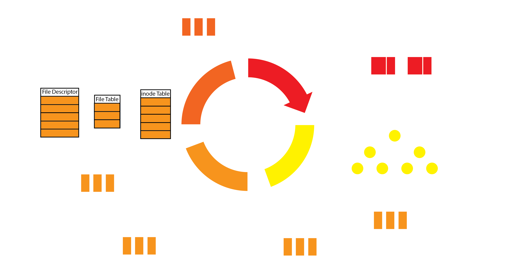
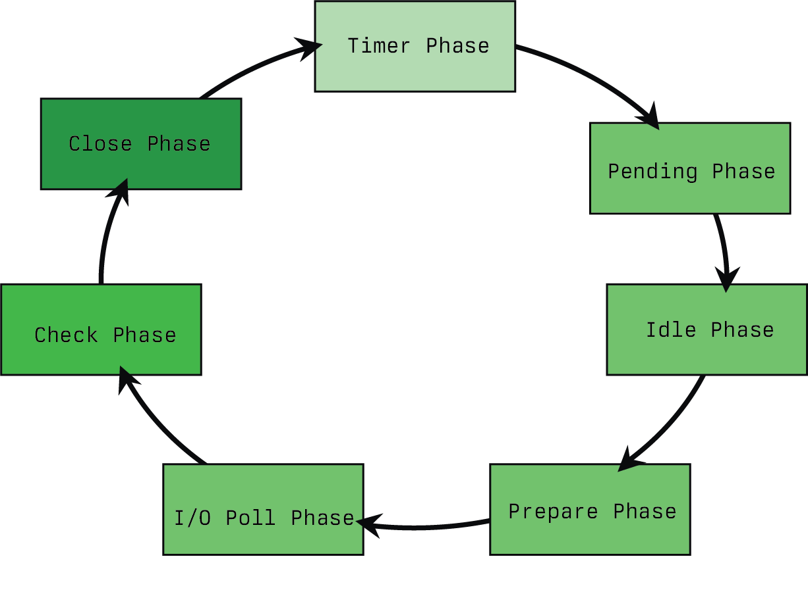
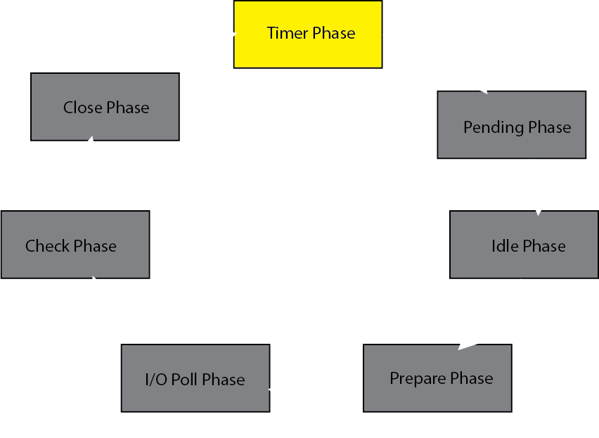
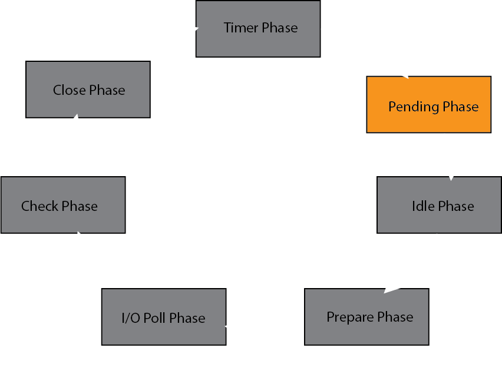
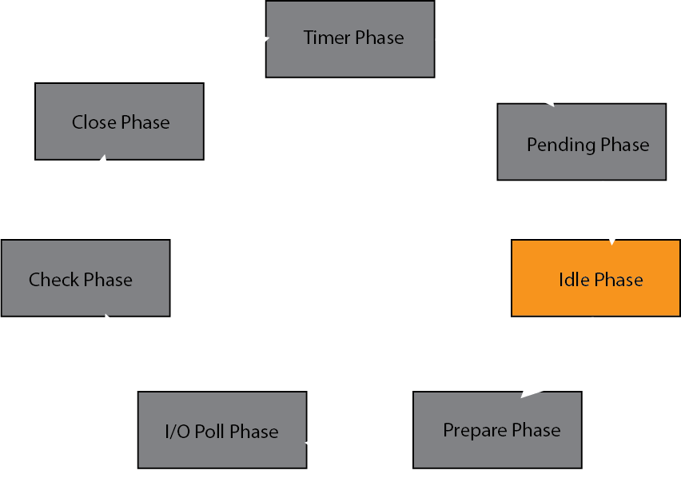
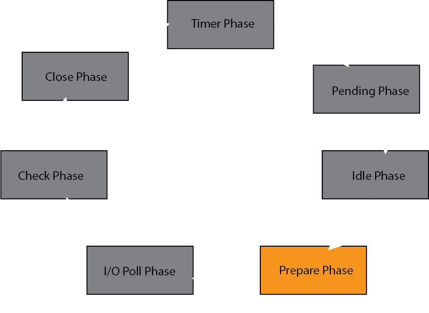
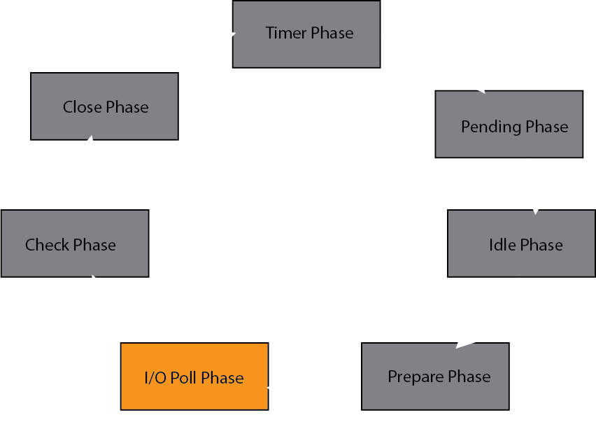
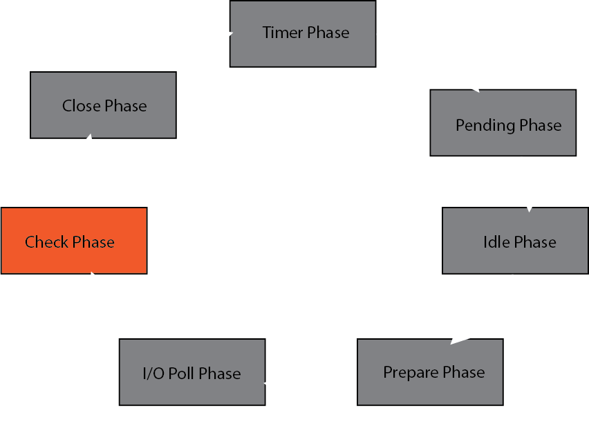
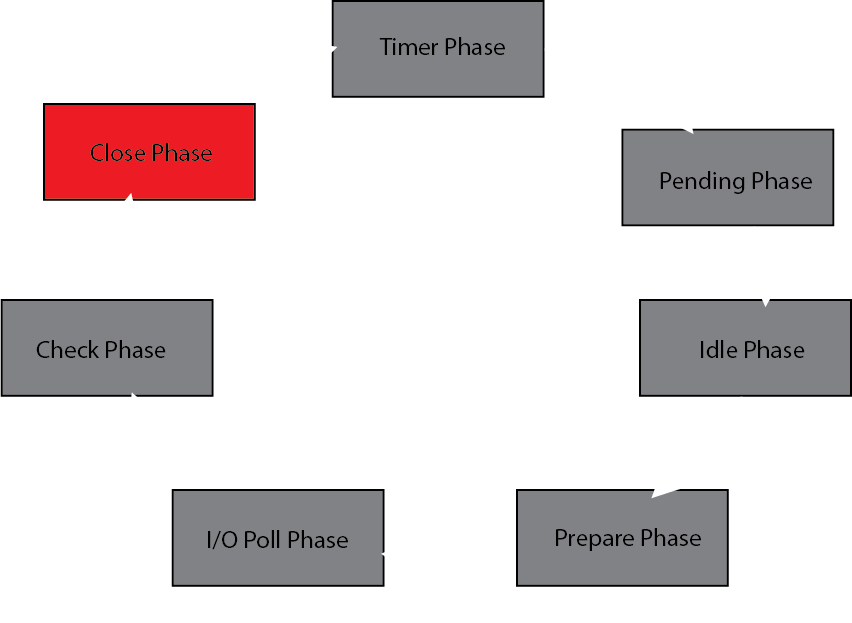

# Introduction

Any dive into the inner workings of Node.js [1] cannot be complete without discussing event loops. The first sentence of About Node.js [3] highlights this without the reader realizing it.

> As an asynchronous event-driven JavaScript runtime, Node.js is designed to build scalable network applications.

The idea of an asynchronous, event-driven runtime is bedrock of Node.js, and it one of the many reasons why it has become so popular today [4]. One of the core pieces of the runtime, and liekly most discussed piece of Node.js is the **event loop** [5]. It is the heart of the Node.js runtime and will be the center piece of this article. The event loop is composed of many pieces, but at it's core is a library called **libuv**. [2] As with any library, the content in this article may drift towards incorrect over time. When I initially produced this content in late 2019, it required several changes to update it for 2025. This article has been drafted with a lens for libuv `v1.x`, specifically around the time of `v1.51.0`.

# What is Libuv?

Libuv arose as an abstraction over libev [6], which itself was modelled after libevent [7]. All of which themselves are abstractions over system calls like `select`, `poll` and `epoll` or event notification interfaces like `kqueue`. And when you first start looking into libuv, you will likely stumble upon the tagline for the library which can be found on Github. That tagline being:

> libuv is a multi-platform support library with a focus on asynchronous I/O [2]

To the keen reader, sounds very much like our *asynchronous, event-driven runtime*, we have just replaced *event-driven* with I/O. But Libuv isn't built just for Node.js. It has a pretty large number of features within the library. Those include:

* *Full-featured event loop backed by epoll, kqueue, IOCP, event ports.*
* *Asynchronous TCP and UDP sockets*
* *Asynchronous DNS resolution*
* *Asynchronous file and file system operations*
* *File system events*
* *ANSI escape code controlled TTY*
* *IPC with socket sharing, using Unix domain sockets or named pipes (Windows)*
* *Child processes*
* *Thread pool*
* *Signal handling*
* *High resolution clock*
* *Threading and synchronization primitives*

The predominant majority of which I will not be tackling in this article. My primary focus in this article will be to draw attention to what I believe is the main feature for the purposes of Node.js. That being:

> Full-featured event loop backed by epoll, kqueue, IOCP, event ports. 

There will be discuss of other features in order to fully encapsulate what it means to run an event loop. But, the primary focus of this article will be to help the reader gain a deeper understanding of the **event loop provided by libuv**.

# The Event Loop

An event loop is a design pattern that focuses around the control flow of events. The loop will perform requests from events by invoking handlers associated with events. This type of design pattern often arises in single threaded environments, but is not limited to it. Node.js is often incorrectly described a single-threaded system and this misnomer arises from the use of the event loop pattern. libuv describes their event loop in the following way:

> The event loop is the central part of libuv’s functionality. It takes care of polling for I/O and scheduling callbacks to be run based on different sources of events

Which falls in line with our definition of an event loop design pattern. In fact, libuv's is an application of the Reactor Pattern. [19] And libuv is not the only application of this pattern. Nginx, Netty, Spring, Tokio and Twisted all arose as applications of this pattern. It has proven to be a strong design pattern for I/O handling in particular. Libuv, like an application, puts it's own special twist on the idea. It breaks the event loop into phases. The phases of the libuv event loop are as follows:

- Timer
- Pending
- Idle
- Prepare
- I/O
- Check
- Close

These are represented both in the internal data structure, as well as the looping code itself. As a note, I find one of the best ways to deeply understand ideas is by looking at code. There is a great deal happening in the libuv codebase, so I will endeavor to summarize as best I can. The majority of the code we will be looking at is written in C. However, I find it's written well enough that most with a programming background should be able to understand the code at a glance. Let's start by looking at a representation of the event loop in libuv. This is one of the primary data structures in the library and is used to create the `loop` which is referenced almost everywhere meaningful within the code.

```c
struct uv_loop_s {
  void* data;
  unsigned int active_handles;
  struct uv__queue handle_queue;
  union {
    void* unused;
    unsigned int count;
  } active_reqs;
  void* internal_fields;
  unsigned int stop_flag;
  UV_LOOP_PRIVATE_FIELDS
};
```

While this gives us some insight, it's not as useful without breaking down the tail-end of the struct definition, given by `UV_LOOP_PRIVATE_FIELDS`. This is where the interesting pieces of the struct start to come into view. As an additional note, libuv has both Unix and Windows support being multi-platform. I have a strong proclivity for Unix systems, so when we are presented with multiple options for a snippet of code, we will be looking at the Unix variant. This Unix variant for `UV_LOOP_PRIVATE_FIELDS` can be summarized like so.

```c
#define UV_LOOP_PRIVATE_FIELDS

  /*...skipped fields */

  struct uv__queue pending_queue;
  struct uv__queue watcher_queue;
  uv__io_t** watchers;

  /*...skipped fields */

  uv_mutex_t wq_mutex;
  uv_async_t wq_async;
  uv_rwlock_t cloexec_lock;
  uv_handle_t* closing_handles;
  struct uv__queue process_handles;
  struct uv__queue prepare_handles;
  struct uv__queue check_handles;
  struct uv__queue idle_handles;
  struct uv__queue async_handles;

  /*...skipped fields */

  struct {
    void* min;
    unsigned int nelts;
  } timer_heap;

  /*...skipped fields */
```

As you can tell, there are a number of fields not represented here. Because even with the qualifier of Unix focused code, there is significant variety in the compilation targets. This will be a common theme, I will try to focus the code and discussion where I feel there is the most importance. What I do want to call out is the handles, which are prefixed with the phase names that they correspond to. We will explore the use of these data structures as we iterate through the various phases of the event loop. But data alone does not make a program, we need control as well. So what does the execution of the event loop look like?

```c
int uv_run(uv_loop_t* loop, uv_run_mode mode) {
  /*...skipped logic */
  
  if (!r)
    uv__update_time(loop);

  /*...skipped logic */

  while (r != 0 && loop->stop_flag == 0) {
    /*...skipped logic */

    uv__run_pending(loop);
    uv__run_idle(loop);
    uv__run_prepare(loop);

    /*...skipped logic */

    uv__io_poll(loop, timeout);

    /*...skipped logic */

    uv__run_check(loop);
    uv__run_closing_handles(loop);

    uv__update_time(loop);
    uv__run_timers(loop);

    /*...skipped logic */
  }

  /*...skipped logic */

  return r;
}
```

As you can see, there is again a suffix indicating the phase that the function corresponds to. I want to call special attention to a particular aspect of the event loop, which is `uv__update_time`. One of the foundational components of the event loop is time. While a large part of the `uv_loop_s` data structure is dedicated to queues for handles, there is a core component called the `timer_heap`. The `timer_heap` is a min-heap [20] data structure. And a key part of the reliable running of timers is the concept of "now", which is controlled, in part through `uv__update_time`. The event loop tries to maintain millisecond level tick precision in order to reliably execute timers. So now that we have somewhat of an understanding of the data and control code associated with the event loop, let's take a deeper look at the individual phases themselves.

# Phases of the Event Loop

Node.js only has commonly been referred to as having only four phases, those being the phases associated `setImmediate`, `setTimeout`, I/O polling and closing. This isn't completely correct, but we will be using this approximation as a visual tool for our subsequent diagrams. I find that illustrations tend to help guide the conversation in a structured manner. So as we discuss each phase, I would like to provide two images to guide an understanding. The first is a representation of the event loop itself, this is the graphical equivalent of `uv_loop_s` for the intent of this article. This highlights the core data structures in place, and collapse some of the phases to this approximate four phase set.




As you can see from the diagram, there are several core data structures in play. There are queues, min-heaps and 
The second is just an encapsulation of the phases within the event loop. This is accurate to the function of Libuv itself. And while Node.js will collapse Pending, Idle, Prepare and I/O Poll into one phase. Libuv supports additionally functionality beyond the scope of just Node.js.



## Timer



```c
void uv__run_timers(uv_loop_t* loop) {
 struct heap_node* heap_node;
 uv_timer_t* handle;

 for (;;) {
   heap_node = heap_min(timer_heap(loop));
   if (heap_node == NULL)
     break;

   handle = container_of(heap_node, uv_timer_t, heap_node);
   if (handle->timeout > loop->time)
     break;

   uv_timer_stop(handle);
   uv_timer_again(handle);
   handle->timer_cb(handle);
 }
}
```

## Pending



```c
static int uv__run_pending(uv_loop_t* loop) {
 QUEUE* q;
 QUEUE pq;
 uv__io_t* w;

 if (QUEUE_EMPTY(&loop->pending_queue))
   return 0;

 QUEUE_MOVE(&loop->pending_queue, &pq);

 while (!QUEUE_EMPTY(&pq)) {
   q = QUEUE_HEAD(&pq);
   QUEUE_REMOVE(q);
   QUEUE_INIT(q);
   w = QUEUE_DATA(q, uv__io_t, pending_queue);
   w->cb(loop, w, POLLOUT);
 }

 return 1;
}
```

## Idle



```c
#define UV_LOOP_WATCHER_DEFINE(name, type)                                                                                                             
 ...
 void uv__run_##name(uv_loop_t* loop) {                                      
   uv_##name##_t* h;                                                         
   QUEUE queue;                                                              
   QUEUE* q;                                                                 
   QUEUE_MOVE(&loop->name##_handles, &queue);                                
   while (!QUEUE_EMPTY(&queue)) {                                            
     q = QUEUE_HEAD(&queue);                                                 
     h = QUEUE_DATA(q, uv_##name##_t, queue);                                
     QUEUE_REMOVE(q);                                                        
     QUEUE_INSERT_TAIL(&loop->name##_handles, q); 
     h->name##_cb(h);                                                        
   }                                                                       
 }
```

## Prepare



```c
#define UV_LOOP_WATCHER_DEFINE(name, type)                                                                                                             
 ...
 void uv__run_##name(uv_loop_t* loop) {                                      
   uv_##name##_t* h;                                                         
   QUEUE queue;                                                              
   QUEUE* q;                                                                 
   QUEUE_MOVE(&loop->name##_handles, &queue);                                
   while (!QUEUE_EMPTY(&queue)) {                                            
     q = QUEUE_HEAD(&queue);                                                 
     h = QUEUE_DATA(q, uv_##name##_t, queue);                                
     QUEUE_REMOVE(q);                                                        
     QUEUE_INSERT_TAIL(&loop->name##_handles, q); 
     h->name##_cb(h);                                                        
   }                                                                       
 }
```

## I/O Poll



```c
void uv__io_poll(uv_loop_t* loop, int timeout) {
 ...
 while (!QUEUE_EMPTY(&loop->watcher_queue)) {
   ...
   w = QUEUE_DATA(q, uv__io_t, watcher_queue);
   ...
   w->events = w->pevents;
 }
    ...
    nfds = epoll_wait(loop->backend_fd, events, ARRAY_SIZE(events), timeout);
   for (i = 0; i < nfds; i++) {
     ...
     w = loop->watchers[fd];
     ...
     pe->events &= w->pevents | POLLERR | POLLHUP;
    ...
   }
  ...
}
```

## Check



```c
#define UV_LOOP_WATCHER_DEFINE(name, type)                                                                                                             
 ...
 void uv__run_##name(uv_loop_t* loop) {                                      
   uv_##name##_t* h;                                                         
   QUEUE queue;                                                              
   QUEUE* q;                                                                 
   QUEUE_MOVE(&loop->name##_handles, &queue);                                
   while (!QUEUE_EMPTY(&queue)) {                                            
     q = QUEUE_HEAD(&queue);                                                 
     h = QUEUE_DATA(q, uv_##name##_t, queue);                                
     QUEUE_REMOVE(q);                                                        
     QUEUE_INSERT_TAIL(&loop->name##_handles, q); 
     h->name##_cb(h);                                                        
   }                                                                       
 }
```

## Close



```c
static void uv__run_closing_handles(uv_loop_t* loop) {
 uv_handle_t* p;
 uv_handle_t* q;

 p = loop->closing_handles;
 loop->closing_handles = NULL;

 while (p) {
   q = p->next_closing;
   uv__finish_close(p);
   p = q;
 }
}
```

# Summary


# References

1. [https://nodejs.org/](https://nodejs.org/en/)
2. [https://github.com/libuv/libuv](https://github.com/libuv/libuv)
3. [https://nodejs.org/en/about/](https://nodejs.org/en/about/)
4. [https://insights.stackoverflow.com/survey/2020#technology-most-loved-dreaded-and-wanted-other-frameworks-libraries-and-tools](https://insights.stackoverflow.com/survey/2020#technology-most-loved-dreaded-and-wanted-other-frameworks-libraries-and-tools)
5. [https://nodejs.org/en/docs/guides/event-loop-timers-and-nexttick/#what-is-the-event-loop](https://nodejs.org/en/docs/guides/event-loop-timers-and-nexttick/#what-is-the-event-loop)
6. [https://github.com/enki/libev](https://github.com/enki/libev)
7. [https://github.com/libevent/libevent](https://github.com/libevent/libevent)
8. [https://acemood.github.io/2016/02/01/event-loop-in-javascript/](https://acemood.github.io/2016/02/01/event-loop-in-javascript/)
9. [https://www.youtube.com/watch?v=sGTRmPiXD4Y](https://www.youtube.com/watch?v=sGTRmPiXD4Y)
10. [https://gist.github.com/trevnorris/1f3066ccb0fed9037afa](https://gist.github.com/trevnorris/1f3066ccb0fed9037afa)
11. [https://nodejs.org/en/docs/guides/event-loop-timers-and-nexttick/](https://nodejs.org/en/docs/guides/event-loop-timers-and-nexttick/)
12. [https://blog.libtorrent.org/2012/10/asynchronous-disk-io/](https://blog.libtorrent.org/2012/10/asynchronous-disk-io/)
13. [https://www.youtube.com/watch?v=zphcsoSJMvM](https://www.youtube.com/watch?v=zphcsoSJMvM)
14. [https://www.youtube.com/watch?v=PNa9OMajw9w](https://www.youtube.com/watch?v=PNa9OMajw9w)
15. [https://www.dynatrace.com/news/blog/all-you-need-to-know-to-really-understand-the-node-js-event-loop-and-its-metrics/#disqus_thread](https://www.dynatrace.com/news/blog/all-you-need-to-know-to-really-understand-the-node-js-event-loop-and-its-metrics/#disqus_thread)
16. [https://www.youtube.com/watch?v=P9csgxBgaZ8](https://www.youtube.com/watch?v=P9csgxBgaZ8)
17. [http://docs.libuv.org/en/latest/design.html#the-i-o-loop](http://docs.libuv.org/en/latest/design.html#the-i-o-loop)
18. [https://medium.com/@copyconstruct/nonblocking-i-o-99948ad7c957](https://medium.com/@copyconstruct/nonblocking-i-o-99948ad7c957)
19. https://en.wikipedia.org/wiki/Reactor_pattern
20. https://en.wikipedia.org/wiki/Min-max_heap
